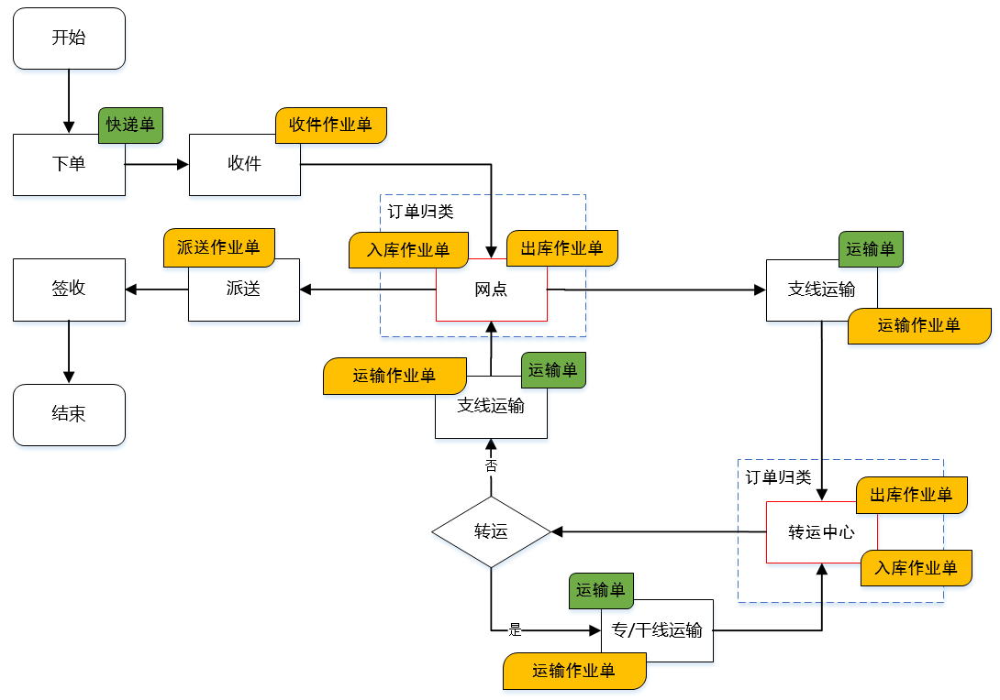
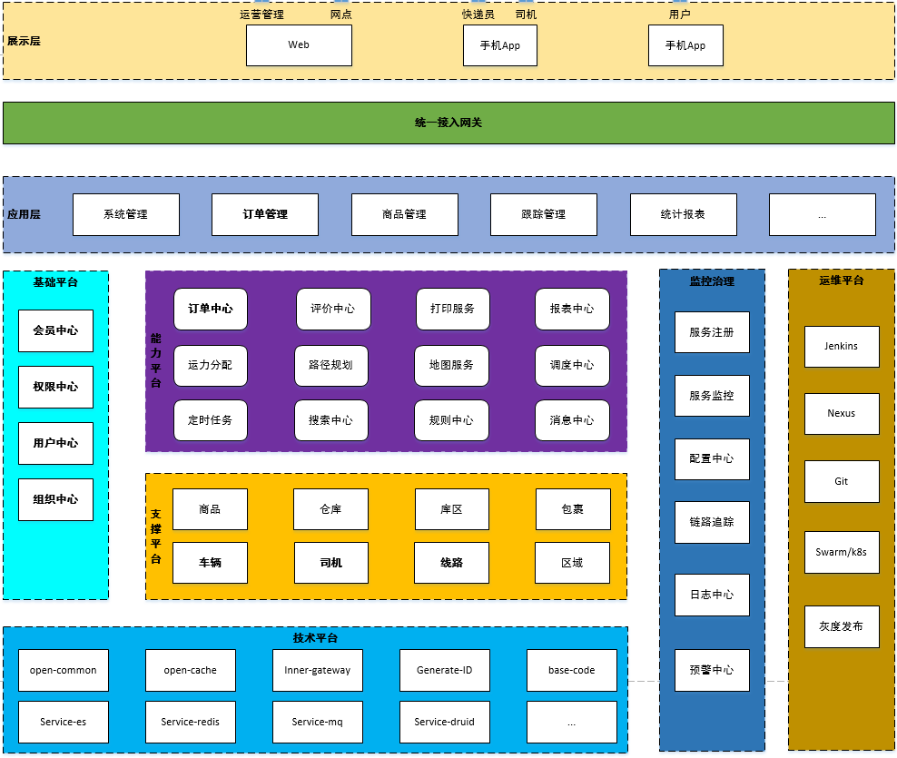
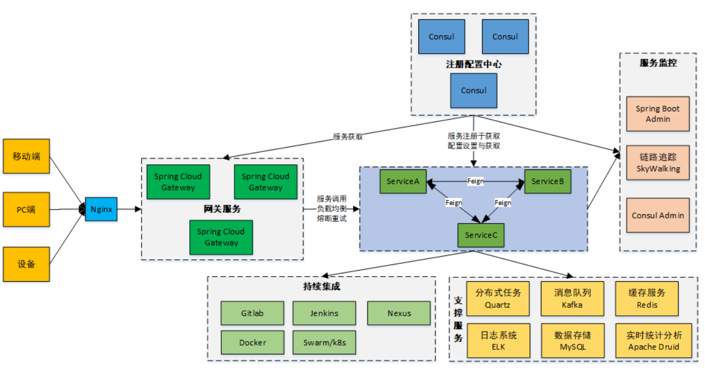
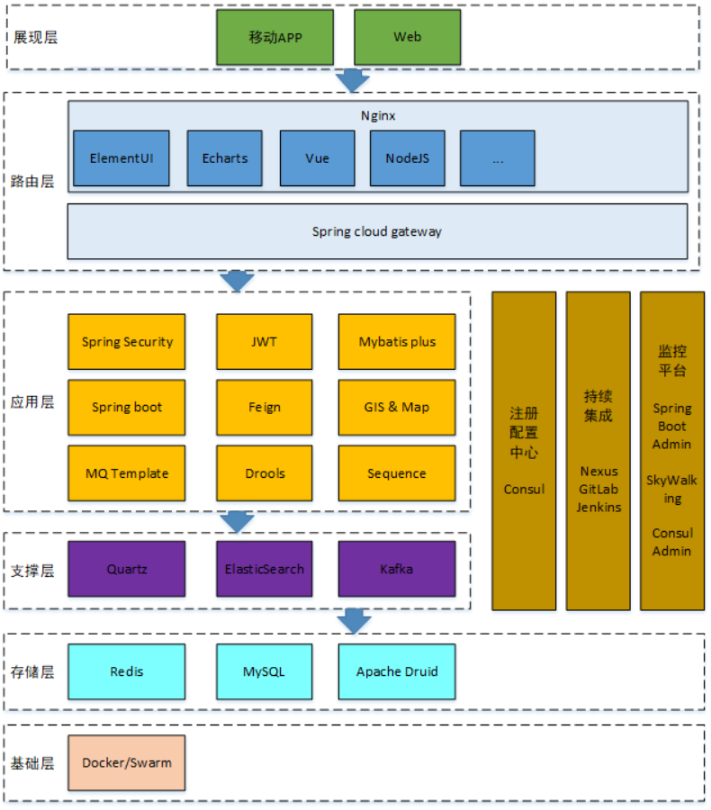

<div align="center">

# 🚚 品达物流 TMS（pinda-tms）

**对运输作业从运力资源准备到最终货物抵达目的地的全流程管理。**


</div>

> **一句话定位**：品达物流 TMS 是一套面向运输公司与企业运输队的**运输管理系统（TMS）**，覆盖订单管理、配载作业、调度分配、行车管理、GPS 车辆定位、车辆与线路管理、人员管理、数据报表与基础信息维护，让运输运作效率与成本管控一步到位。

---

## 项目是什么 · 解决什么问题

物流运输市场最普遍的四种业态是 **快递、快运、专线、三方**，它们支撑着全国商品货物的流通。无论是哪一类企业，核心痛点都高度一致：**车辆、驾驶员、线路散落难管，运输过程不透明，调度与计费靠人工，成本与时效无从考核**。

品达物流 TMS 正是为解决这些问题而生——它把「运力资源准备 → 下单 → 调度 → 运输 → 派送 → 签收 → 结算」的全链路搬进一套系统，对车辆、驾驶员、线路进行全面详尽的统计与考核，帮助企业**提高运作效率、降低运输成本，在激烈的市场竞争中处于领先地位**。

---

## ✨ 核心优势

- **全流程闭环**：从运力资源准备到货物抵达目的地，订单 / 调度 / 运输 / 派送 / 签收 / 结算一条龙打通，不留断点。
- **四端协同**：后台管理端、客户端 App、快递员端 App、司机端 App 一体化设计，信息在四端间实时流转。
- **微服务架构**：按业务拆分为多个微服务，注册配置统一、服务间松耦合，易于扩展与维护。
- **动态规则引擎**：集成 Drools 规则引擎，运费计算与业务规则可灵活配置，告别硬编码。
- **智能调度分配**：基于定时调度与路径规划，自动完成订单分类、运输任务创建与车辆 / 司机分配。
- **实时定位与轨迹**：GPS 车辆定位 + 轨迹回放，运输过程全程可视，异常可及时发现。
- **开箱即用的支撑平台**：内置通用权限系统、文件服务、注册登录与短信能力，基础支撑直接复用。

---

## 🎯 解决的核心痛点

| 行业痛点 | 品达 TMS 的解法 |
| --- | --- |
| 车辆 / 驾驶员 / 线路分散，难以统一考核 | 基础数据集中管理 + 多维统计报表，人车线一目了然 |
| 调度靠人工、配载凭经验 | 定时调度 + 路径规划自动生成运输任务与车次分配 |
| 运输过程黑盒，在途不可见 | GPS 车辆定位 + 轨迹回放，在途状态实时可查 |
| 运费计算不透明、易出错 | Drools 动态规则引擎，计费规则可配置、可追溯 |
| 客户查件无渠道、签收无留证 | 客户端 App 查物流 + 电子签收 / 回单留证 |
| 数据孤岛、统计靠手工 | 数据聚合 + 实时分析，经营报表自动产出 |

---

## 📱 四端协同

| 端 | 名称 | 使用对象 | 核心能力 |
| --- | --- | --- | --- |
| 后台系统管理端 | 品达 TMS 管理端 | 公司内部管理员 | 基础数据维护、订单管理、运单管理 |
| 客户端 App | **品达速运** | 外部客户 | 寄件、查询物流信息 |
| 快递员端 App | **品达快递员** | 公司内部快递员 | 接收取派件任务 |
| 司机端 App | **品达司机宝** | 公司内部司机 | 接收运输任务、上报位置信息 |

---

## 🔍 功能全景

### 整体业务流程



从寄件人下单到收件人签收，品达 TMS 覆盖完整业务链路：

```
客户下单 → 取件 → 干线运输 → 末端派送 → 签收 → 结算
```

### 核心业务模块

| 模块 | 功能描述 |
| --- | --- |
| **订单管理** | 寄件下单、货物管理、订单全生命周期状态管理、运费试算 |
| **智能调度** | 订单分类、路径规划、运输任务创建、车次 / 车辆 / 司机分配 |
| **运输管理（行车管理）** | 运输任务执行、司机作业单、在途状态跟踪 |
| **GPS 车辆定位 / 在途监控** | 车辆实时定位、轨迹回放、偏航与异常监控 |
| **配送执行** | 取派件任务、运单管理、电子签收（POD） |
| **车辆 / 线路 / 车次管理** | 车队、车辆、车型、线路、车次等运输资源维护 |
| **人员管理** | 司机、快递员、岗位与组织管理 |
| **客户门户** | 客户端 App 寄件、查单、物流跟踪 |
| **回单与结算** | 回单签收留证、费用结算、对账 |
| **数据报表** | 运输量、时效、成本、绩效等多维统计 |
| **基础信息维护** | 组织机构、菜单、权限、字典等支撑数据 |
| **通用权限** | 用户、角色、菜单、认证与鉴权统一管理 |

### 订单状态机（示例）

订单生命周期由一套多级状态机驱动，典型流转如下：

```
待取件 → 已取件 → 待装车 → 运输中 → 网点出库 → 待派送 → 派送中 → 已签收
                                                  └→ 拒收 / 已取消
```

---

## 🏗 技术方案

### 系统架构



### 微服务架构



### 技术架构



### 技术亮点

| 技术 | 在系统中的作用 |
| --- | --- |
| **Drools 动态规则引擎** | 运费计算与业务规则配置，规则可热更新 |
| **Quartz 定时调度** | 周期性触发智能调度任务，编排调度流程 |
| **J2Cache 两级缓存** | 本地 + 远程两级缓存，提升高频数据访问性能 |
| **Redisson 分布式锁** | 分布式环境下的并发控制与资源互斥 |
| **Seata 分布式事务** | 跨服务数据一致性保障 |
| **Zipkin 链路追踪** | 微服务调用链监控与问题定位 |
| **Canal / Otter 数据同步** | 业务数据变动捕获与多库同步，支撑聚合查询 |
| **Apache Druid 实时分析** | 海量业务数据的实时分析与报表 |
| **百度地图 API** | 地址解析、距离计算、轨迹与地图展示 |
| **Netty** | 高并发 TCP / HTTP 通道，支撑轨迹与设备接入 |
| **通用权限平台** | 统一用户、角色、菜单、认证与鉴权 |
| **Shiro / JWT** | 请求认证与无状态鉴权 |

### 数据库设计

系统按业务域分库，共使用以下数据库：

| 数据库 | 说明 |
| --- | --- |
| `pd_base` | 基础数据：货物类型、车辆类型、车队、线路、车次等 |
| `pd_users` | C 端用户：用户信息、地址簿等 |
| `pd_oms` | 订单：货物信息、订单信息、订单位置信息等 |
| `pd_work` | 物流作业：取派件任务、运输任务、司机作业单、运单等 |
| `pd_aggregation` | 聚合数据：多库数据统一聚合，便于查询 |
| `pd_dispatch` | 智能调度：订单分类、缓存路线等调度相关数据 |
| `pd_auth` | 通用权限：资源、菜单、权限、岗位、组织、角色等 |
| `customer_auth` | C 端用户认证：登录认证信息、登录记录等 |

---

## 🚀 快速了解

### 环境与技术栈

- **后端**：基于 Spring Cloud 微服务架构，Nacos 作为注册 / 配置中心，服务间通过 Feign 调用，统一网关鉴权。
- **前端**：管理端 Vue 工程；三端移动 App（客户端 / 快递员端 / 司机端）。
- **存储与中间件**：MySQL（按业务分库）、Redis 缓存、消息队列、地图服务等。
- **支撑服务**：通用权限系统、文件服务、短信服务、注册登录服务（均开箱集成）。

### 启动步骤（概览）

1. **初始化数据库**：执行资料中的 SQL 脚本完成各业务库建库与基础数据初始化。
2. **启动 Nacos**：导入配置文件，作为服务注册与配置中心。
3. **导入并构建工程**：导入 Maven 工程与各微服务，完成编译。
4. **启动微服务与前端**：依次启动后端微服务与管理端 / 移动端，即可访问。

> 详细的部署、配置与二次开发说明见下方「相关资料」。运行本项目需配套虚拟机镜像，请见文末「📦 配套虚拟机」向作者索取。

---

## 📚 相关资料

以下文档均为仓库内本地文件，可直接跳转阅读：

| 文档 | 说明 |
| --- | --- |
| [docs/架构设计.md](docs/架构设计.md) | 系统架构、服务划分、调用关系与部署拓扑 |
| [docs/技术栈说明.md](docs/技术栈说明.md) | 技术栈说明与核对 |
| [docs/功能规划与需求说明.md](docs/功能规划与需求说明.md) | 功能清单与需求说明 |
| [docs/部署与二次开发指南.md](docs/部署与二次开发指南.md) | 部署、初始化与二次开发指引 |
| [docs/部署文档.md](docs/部署文档.md) | 中间件部署手册 |
| [docs/品达TMS-开发测试环境手册.md](docs/品达TMS-开发测试环境手册.md) | 开发 / 测试环境说明 |
| [docs/需求文档/索引.md](docs/需求文档/索引.md) | 需求文档总索引 |
| [docs/需求文档/业务需求全景.md](docs/需求文档/业务需求全景.md) | 业务需求全景 |
| [docs/需求文档/物流项目功能需求分析.md](docs/需求文档/物流项目功能需求分析.md) | 功能需求分析 |

**设计图**（位于 `docs/`）：`系统架构.png`、`技术架构.png`、`整体业务流程.png`、`微服务架构.png`、`软件架构体系.png`、`服务列表.png`。

---

## 📦 配套虚拟机（环境镜像）

> 本项目的学习与部署**依赖配套的虚拟机镜像**——镜像中已预置好运行所需的中间件、数据库与基础环境，省去自行搭建的繁琐。
> 该镜像通过**百度网盘**分发，**链接不公开**，需要请直接向作者索取最新网盘地址。

---

## 🤝 商业服务与联系

<div align="center">

<table>
<tr>
<td align="center" width="50%">

### 🛠️ 付费技术服务

本项目 **Apache-2.0 完全开源免费**。同时作者提供商业支持，助你少走弯路：

- 🔧 **二次开发 / 功能定制**（对接平台、新增业务、UI 调整）
- 🚀 **私有化部署交付**（服务器、域名、环境一条龙，含配套虚拟机镜像）
- 🎓 **项目讲解 / 毕设答疑**（架构、源码、面试考点）
- 📦 **全量建库脚本 + 演示数据**
- 💬 日常技术答疑与长期维护支持

<b>👉 商务联系 QQ：<code>747011882</code></b>

</td>
<td align="center" width="50%">

### 💬 加入社区


<sub>扫码关注微信公众号「心飞为你飞」</sub>

<br>

🔗 仓库：[gitee.com/itxinfei/pinda-tms](https://gitee.com/itxinfei/pinda-tms)
🏠 作者主页：[gitee.com/itxinfei](https://gitee.com/itxinfei)

</td>
</tr>
</table>

<br>

### ⭐ 如果这个项目对你有帮助，欢迎点个 Star 支持，这是对我最大的鼓励！

</div>

---

<p align="center"><sub>品达物流 TMS · 开源运输管理系统 · 全流程 · 四端协同 · 微服务架构</sub></p>
