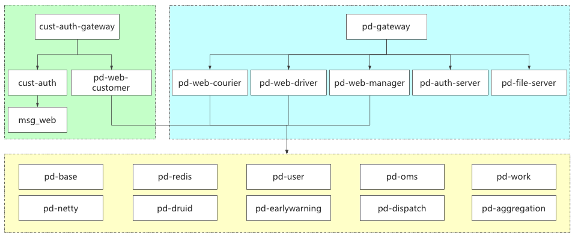

# 品达物流 TMS — 架构设计

> 本文档描述品达物流 TMS 的系统架构、服务划分、调用关系、部署拓扑与核心业务流程设计。
> 架构与功能现状均基于**源码与联调环境实测**，详见 [技术栈说明.md](技术栈说明.md) 与 [功能规划与需求说明.md](功能规划与需求说明.md)。
> 需求层面的权威输入见 [需求文档/需求文档v2_现状梳理与竞品借鉴.md](需求文档/需求文档v2_现状梳理与竞品借鉴.md)。

---

## 1. 架构原则

- **微服务化**：业务按域拆分为独立服务，各自拥有数据源，通过 Nacos 注册与配置、Feign 互相调用。
- **数据分层**：业务库按微服务分库（共 7 个），避免跨库事务；跨服务写通过 Seata（可降级）或最终一致（Kafka/RabbitMQ 事件）处理。
- **统一入口与鉴权**：所有外部请求经 Zuul 网关（`:8760/api`）统一路由与 JWT 鉴权；`pd-web` 作为面向管理端与三端的 BFF 接口层。
- **事件驱动**：轨迹数据经 Kafka 异步解耦；调度事件经 RabbitMQ 分发。
- **状态机优先**：核心业务状态变更走统一状态机与校验器（CAS 防并发），禁止裸 `setStatus()`。

---

## 2. 逻辑分层


| 层 | 组成 | 说明 |
|----|------|------|
| **接入层** | `pd-gateway`（Zuul 1.x，:8760/api）、`pd-web`（manager/driver/courier/customer，8161~8164） | 统一路由、鉴权、限流；BFF 聚合接口 |
| **业务服务层** | `pd-oms` / `pd-dispatch` / `pd-work` / `pd-base` / `pd-netty` / `pd-user` / `pd-authority` | 领域微服务，Nacos 注册 |
| **数据层** | MySQL（7 业务库）、Redis 5、Kafka 2.6、RabbitMQ 3.8、Seata 1.4.2 | 持久化、缓存、消息、分布式事务 |
| **支撑层** | `pd-common`、`pd-service-api`、`pd-druid`、`pd-aggregation` | 公共组件、Feign 契约、监控、聚合查询 |

---

## 3. 服务划分与职责

| 模块 | 职责 | 数据库 |
|------|------|--------|
| `pd-oms` | 订单服务：12 级状态机、Drools 计价、地图解析 | `pd_oms` |
| `pd-dispatch` | 智能调度：Quartz 5 阶段、DFS 路径规划 | `pd_dispatch` |
| `pd-work` | 配送作业：运单 / 运输任务 / 司机作业 / 取派件 | `pd_work` |
| `pd-base` | 基础数据：机构 / 车辆 / 司机 / 线路 / 车队（约 20 表） | `pd_base` |
| `pd-netty` | 轨迹服务：Netty + Kafka 接入 GPS | `pd_oms`（存 `pd_truck_location`） |
| `pd-user` | C 端用户 | `pd_users` |
| `pd-authority` | 权限中心（含 `pd-auth-server` 认证、`pd-gateway` 网关） | `pd_auth` |
| `pd-web` | BFF 接口层（manager/driver/courier/customer） | 无数据源，走 Feign |
| `pd-aggregation` | 数据聚合查询 | `pd_aggregation` |
| `pd-druid` / `pd-common` / `pd-service-api` | 监控 / 公共 / 契约 | — |

---

## 4. 调用关系与关键链路

**主干链路（下单 → 调度 → 执行 → 轨迹 → 签收）**：

```
客户小程序 ──下单──▶ pd-oms（订单）
                            │
               Quartz 定时触发（pd-dispatch）
                            │ ①订单分类→②DFS路线规划→③创建运输任务→④车次/车辆/司机→⑤司机作业单
                            ▼
                       pd-work（运单 / 运输任务）
                            │ depart/arrive/deliver（乐观锁状态机）
                            ▼
                       末端派送（快递员端）──▶ 签收 ──▶ 回写 pd-oms 订单状态
                            ▲
                   pd-netty（GPS 上报，Netty+Kafka）──▶ 下游消费持久化
```

**跨服务调用**：业务服务间通过 `pd-service-api` 定义的 Feign 接口互调；内部服务**不直连**，须经网关或 Feign。

---

## 5. 部署拓扑




- **编排方式**：Docker Compose（非 Kubernetes）。
- **中间件**：`deploy/middleware/docker-compose.infra.yml`（MySQL / Redis / Nacos / Zookeeper / Kafka / RabbitMQ）。
- **应用**：`deploy/apps/docker-compose.app.yml`（各 Spring Boot 服务 + `pd-admin-ui`，镜像 tag 取 git 短提交号）。
- **CI/CD**：Gitea Actions（`deploy/ci/`），push 触发构建部署。

> 端口与挂载细节、启动顺序、排障见 [部署与二次开发指南.md](部署与二次开发指南.md) 与 [部署文档.md](部署文档.md)。

---

## 6. 数据架构

**按微服务分库**（共 7 个业务库）：

| 库 | 服务 | 端口 |
|----|------|------|
| `pd_auth` | pd-auth-server | 9000 |
| `pd_base` | pd-base | 8185 |
| `pd_oms` | pd-oms | 8186 |
| `pd_work` | pd-web…（pd-work） | 8187 |
| `pd_users` | pd-user | 8189 |
| `pd_dispatch` | pd-dispatch | 8190 |
| `pd_aggregation` | pd-aggregation | 8191 |

- 轨迹表 `pd_truck_location` 建在 `pd_oms`（pd-netty 与 pd-oms 共用）。
- Seata AT 模式要求每个参与事务的库都有 `undo_log` 表（7 个 `pd_` 库均需建）。

---

## 7. 核心业务流程设计

### 7.1 订单状态机（12 级，已实现）

```
23000 待取件 → 23001 已取件 → 23004 待装车 → 23005 运输中
→ 23006 网点出库 → 23007 待派送 → 23008 派送中
→ 23009 已签收 / 23010 拒收 / 23011 已取消
```

- 状态变更必须走 `StateTransitionValidator` + 条件更新（CAS）。
- 运输任务 `TaskTransport`（5 级）与订单 `Order`（12 级）通过统一状态机双向同步（规划中的同步桥，见 [功能规划与需求说明.md](功能规划与需求说明.md) FR-20）。

### 7.2 调度 5 阶段（已实现）

```
① 订单分类 → ② DFS 路线规划 → ③ 创建运输任务 → ④ 车次/车辆/司机分配 → ⑤ 司机作业单
```

- 每个转运中心可独立配置 Quartz cron。
- 路径规划采用递归 DFS，支持距离/成本/时间/中转次数 4 种策略，MD5 校验复用缓存。

### 7.3 跨端契约（规划，P0）

- 三端共享同一份主记录（`Order` / `TransportOrder` / `TaskTransport` / `LocationRecord`），禁止各端私存状态副本。
- 客户查轨迹只凭 `Order.id`（订单号），后端解析到 `transportTaskId`。

---

## 8. 设计图索引

位于 `docs/`：

- `系统架构.png`、`技术架构.png` — 逻辑 / 技术分层
- `微服务架构.png`、`服务列表.png` — 服务划分与端口
- `整体业务流程.png` — 端到端业务流程
- `软件架构体系.png`、`项目介绍.png` — 总体介绍

---

## 9. 与需求文档的关系

| 本文内容 | 权威文档 |
|----------|----------|
| 接口路径与鉴权细节 | [需求文档/后端接口文档.md](需求文档/后端接口文档.md) |
| 状态取值与中文对照 | [需求文档/数据字典与枚举口径.md](需求文档/数据字典与枚举口径.md) |
| 功能优先级与 MVP 拆解 | [需求文档/需求文档v2_现状梳理与竞品借鉴.md](需求文档/需求文档v2_现状梳理与竞品借鉴.md) |
| 部署与运维 | [部署文档.md](部署文档.md) / [品达TMS-开发测试环境手册.md](品达TMS-开发测试环境手册.md) |
