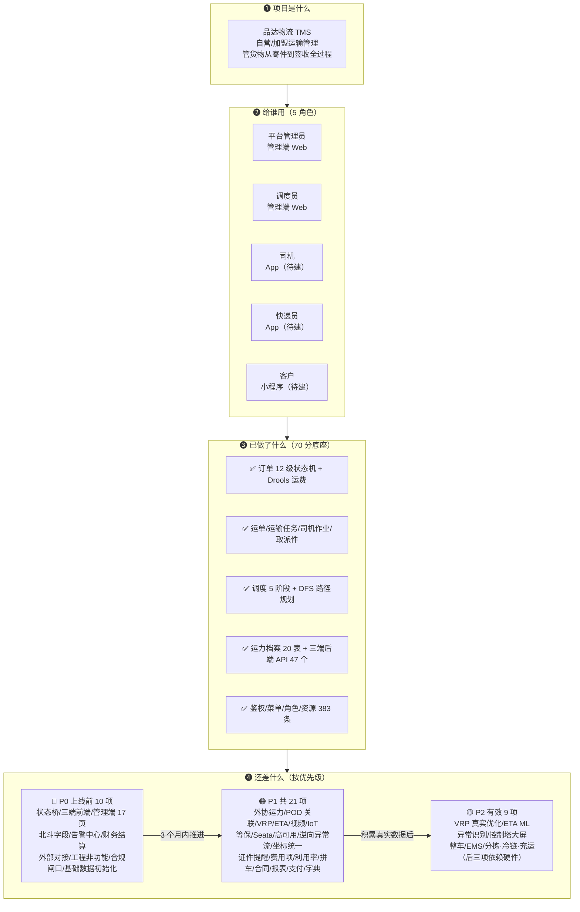

# 业务需求全景（业务方 / 新成员入门）

> **日期**：2026-10-07
> **读者**：业务负责人、新加入的产品/开发/测试、甲方对接人
> **定位**：**不含代码细节**，只讲"这个系统解决什么问题、有哪些角色、每个角色能干什么、现在做到哪一步"
> **技术细节请看**：《08-后端接口文档.md》（接口）、《07-数据字典与枚举口径.md》（状态值）

---

## 〇、5 分钟全貌图（先看这张图，再看下面任何文字）



**速查口径**：
- 想知道"哪个角色干什么" → 看 §三
- 想知道"业务怎么走" → 看 §四
- 想知道"现在做到哪一步" → 看 §五
- 想知道"还差什么、按什么顺序补" → 看《02-优先级总览.md》
- 想知道"哪些事已经定死了不能改" → 看《03-全局定案与待确认项清单.md》

---

## 一、一句话说明

> **品达物流 TMS 是一套"运输管理"系统**：管理货物从**寄件 → 取件 → 干线运输 → 末端派送 → 签收**的全过程，让管理者看得见进度、司机知道干什么、客户随时查到货。

**它不是什么**（重要）：
- ❌ 不是快递公司系统（不对接顺丰/三通一达等外部厂商 API）
- ❌ 不是网络货运平台（不做撮合交易、税务套利）
- ✅ 是**自营/加盟运输管理**：管理自己的车队、司机、网点、客户

---

## 二、两类客户，三种服务形态

| 客户类型 | 典型需求 | 服务形态 |
|---|---|---|
| **零散客户**（个人寄件） | 下单、上门取件、查进度 | 客户小程序 |
| **批量客户**（企业、电商） | 下单、对账、发票 | 管理端（Web）——P0 由管理员代录单；P1 补批量导入（2026-10-08 用户业务拍板：Q-1） |
| **加盟/合作网点** | 收货、发件、交接 | 管理端（Web） |

> 📌 **本项目是"运力管理"而非"揽收营销"**：核心能力是把货**准时送到**，而不是获客。
> 📌 **企业客户下单入口（2026-10-08 用户业务拍板：Q-1）**：P0 阶段由管理员在管理端代录企业客户订单（不单独建企业客户自助下单页）；批量 Excel 导入功能列为 P1 待排，不得提升为 P0。

---

## 三、五个业务角色（谁能用系统干什么）

### 3.1 平台管理员（管理端 Web）

**日常用什么**：
- 看今天有多少单、多少在途、哪些超时
- 派单派车、给司机排任务
- 处理异常（客户投诉、货物破损、拒收）
- 查司机/车辆档案、看证照到期提醒
- 结算对账、开票

**最关心**：时效、成本、差错率。

### 3.2 调度员（管理端 Web）

**日常用什么**：
- 早上看待调度订单，匹配运输线路
- 安排车辆、安排司机
- 调度过程中调整（改派、抢派）

**最关心**：车够不够、线路匹不匹配、少空驶。

### 3.3 司机（App，本期新建）

**日常用什么**：
- 接单、看今天的运输任务
- 到场、装车、拍提货照片
- 途中上报位置（北斗定位）
- 到站、卸货、拍交付照片
- 车辆信息、异常报修

**最关心**：今天干什么、跑哪条线、运费多少。

### 3.4 快递员（App，本期新建）

**日常用什么**：
- 接取件/派件任务
- 扫码取件、拍照留痕
- 派件时**必须问收件人投哪儿**（柜/驿站/上门）
- 签收留证（照片 + 签名）

**最关心**：任务量、单量、绩效。

### 3.5 客户（小程序，本期新建）

**日常用什么**：
- 寄件下单、选时间、填地址
- 运费试算、在线支付
- 查订单进度、看轨迹
- 确认收货、评价

**最关心**：我的货到哪了、什么时候到、运费多少。

---

## 四、核心业务流程（一张图看懂）

```
①客户下单          ②取件              ③干线运输            ④末端派送         ⑤签收
客户小程序    →   快递员/网点    →   司机运输         →   快递员派送    →   客户签收
寄件单创建         上门取件           装车→在途→到站        派件中             确认收货
                   网点入库           报位置(北斗)          投递确认
                                                                        留证
                     ↓ 状态流转（12级订单状态机统一管控）↓
              待取件→已取件→待装车→运输中→网点出库→待派送→派送中→已签收
                                                                        ├拒收
                                                                        └已取消
```

**关键设计**：订单状态有 **12 级**，从下单到签收每一步都有明确状态。客户不需要看懂 12 个状态，小程序上按 **7 档** 展示（2026-10-09 拍板：拒收、取消各单列一档，取代原"4 档/6 档"口径）。内部状态 → 客户档位映射如下，前端**必须查表映射、严禁区间判断**：

| 客户档位 | 对应的内部订单状态（code） |
|---|---|
| ① 待取件 | 23000 待取件 |
| ② 已取件待发货 | 23001 已取件、23002 网点自寄、23003 网点入库、23004 待装车 |
| ③ 运输中 | 23005 运输中、23006 网点出库 |
| ④ 派送中 | 23007 待派送、23008 派送中 |
| ⑤ 已签收 | 23009 已签收 |
| ⑥ 已拒收 | 23010 拒收 |
| ⑦ 已取消 | 23011 已取消 |

> 📌 12 个状态的完整对照见《07-数据字典与枚举口径.md》。

---

## 五、业务痛点与系统怎么解（甲方最关心）

| 痛点 | 系统怎么解 | 对应功能 | 影响 KPI |
|---|---|---|---|
| **货到哪了说不清** | 客户小程序查轨迹 + 地图看车 | 轨迹查询（在途监控） | 客户满意度 |
| **时效无法承诺** | 预计到达时间（ETA）+ 超时预警 | ETA / 时效预警 | 时效 |
| **空驶率高、成本看不清** | 智能调度（算费 + 路径规划）+ 趟次成本油耗看板 | 调度看板 / 成本分析 | 成本 |
| **异常靠人工发现** | 状态机卡点自动告警（长时间无动作、滞留） | 告警中心 | 差错率 |
| **司机/车证照过期 unnoticed** | 证照有效期预警 + 派单前校验 | 车证人证校验 | 合规风险 |
| **客户投诉难闭环** | 异常全生命周期（上报→定责→理赔→关闭） | 异常处理流 | 客户满意度 |
| **快递员投柜纠纷** | 派件前确认投递方式 + 签收留证 | 投递确认（POD） | 合规（避免处罚） |
| **结账算不清** | 运费规则透明 + 对账 + 价格固化 | 结算对账 | 财务准确性 |

---

## 六、现在做到哪一步了（现状体检）

> 这是 2026-10-06 的真实状态，不粉饰。

### 6.1 已经有的（能用）

| 模块 | 现状 |
|---|---|
| 订单管理 | ✅ 12 级状态机、Drools 运费计算、订单查询 |
| 后端 API | ✅ 3 个端（司机/快递员/客户）共 47 个接口已就绪（driver 11 / courier 16 / customer 20） |
| 管理端 | ⚠️ 有 74 个页面，但**核心业务页几乎空白**（现状已由《15-管理端业务页面开发任务卡.md》补齐） |
| 轨迹 | ✅ 车辆/快递员位置上报与查询 |
| 权限 | ✅ 登录、菜单、角色完整 |

### 6.2 完全要新建的（不能直接用）

| 模块 | 现状 |
|---|---|
| **客户端小程序** | ❌ 0 代码，**仅有任务卡文档** |
| **司机端 App** | ❌ 0 代码 |
| **快递员端 App** | ❌ 0 代码 |
| **告警中心** | 🟡 后端已有：`GpsAlertService` 自动告警 + `pd_alarm_record` 落库 + pd-netty `/alarm` 查询/处理接口；**管理端告警处理页待建** |
| **财务结算** | 🟡 服务层已有 `SettlementServiceImpl` 应收结算单；**财务 10 张表未落正式库、无对外 Controller**，闭环待补 |

### 6.3 正在解决的阻塞项

> 🔄 **2026-10-08 收口回写（定案清单 `BA-13`）**：本节原两行是 **2026-10-06 的快照**，其中第一行已闭环。**权威资源数以《00-索引.md》§联调前置的 383 条为准**（本文 §二 架构图 `C6` 节点已同步为"资源 383 条"）；v2 §2.2 亦已回写。另注：本节**原本不含资源条数**，BA-13 描述的"48→90 过期快照"实际只存在于《需求文档v2》§2.2 一行，本节的真实过期项是**状态**。

| 问题 | 影响 | 状态 |
|---|---|---|
| ~~三端接口未注册权限~~ | ~~网关拒绝三端调用~~ | ✅ **已闭环（2026-10-06/07）**：`阻断C_三端接口注册与账号闭环.sql` + `管理端接口资源注册_20261007.sql` 已执行，资源 **48 → 90 → 383 条**（2026-10-07 补注册管理端 293 个接口），driver `GET /user/profile` 经网关 5/5 返回 200。依据《00-索引.md》§联调前置 |
| 菜单不显示 | 登录后看不到菜单 | ✅ **已定案 `D-42`**：菜单由后端 `getRouter` 动态下发 + RBAC 过滤，废弃前端 `staticMenu`；前后端按此实现即可 |

---

## 七、给不同读者的阅读路径

| 你是 | 建议先读 | 再读 |
|---|---|---|
| **业务方 / 甲方** | 本文档 | 《10-物流行业合规与监管要求.md》 |
| **产品经理** | 本文档 | 《需求文档 v2.4》（§3 竞品分析）→《23-整体项目排期总览甘特.md》 |
| **后端开发** | 《06-开发规范与需求规格说明书.md》 | 《08-后端接口文档.md》→《07-数据字典与枚举口径.md》 |
| **前端开发** | 对应端任务卡 | 《09-多端数据打通与统一领域模型.md》→《08-后端接口文档.md》 |
| **测试** | 《09-多端数据打通与统一领域模型.md》 | 《26-联调就绪检查清单.md》→《28-环境故障排障手册.md》 |
| **运维** | 《28-环境故障排障手册.md》 | — |

---

## 八、合规底线（业务方必须知道）

系统要跑 commercially，以下是**硬要求**，不是可选项：

| 要求 | 依据 | 违反后果 |
|---|---|---|
| **投递前必须取得收件人同意**（投柜/驿站要确认） | 《快递市场管理办法》 | 最高罚 3 万 |
| **12 吨以上货车必须北斗监控且在线** | 《道路运输车辆动态监督管理办法》 | 禁运营 |
| **轨迹必须真实**，不得空转走单 | 交通运输数据规范 | 罚款+信用降级 |
| **个人信息采集须单独同意**（位置信息） | 《网络数据安全管理条例》 | 网信处罚 |
| **运单/轨迹/结算数据留存 ≥3 年** | 税务稽查要求 | 无法举证 |

> 📌 详见《10-物流行业合规与监管要求.md》。**排期上 3 项 P0 为上线硬闸口（FR-30/31/36：投递确认/轨迹真实/离线禁排班），不做完不能上线；FR-32~35 为 P1 体系化合规（数据分级/单独同意/审计/存储加密），不阻断 MVP 但需限期补（见需求文档 v2.4 §5.3）。**

---

## 九、常见问题（FAQ）

**Q：为什么管理端已有 74 个页面，却说"业务页几乎空白"？**
A：74 个页面里大部分是**系统管理类**（用户/角色/菜单/组织/岗位/日志/接口支付），真正的**物流业务页**（订单/运单/调度看板/在途监控/告警/结算）基本没做；现已由《15-管理端业务页面开发任务卡.md》补齐。

**Q：为什么三端（司机/快递员/客户）后端接口有了，前端却要重做？**
A：后端接口是给 Web 调用的（返回 JSON），移动端要的是 App/小程序界面，**不能直接用**。而且技术栈已敲定（uni-app + Vue3）。

**Q：客户查轨迹为什么还不方便？**
A：pd-netty 底层轨迹只认 `businessId`+`type`（车辆/快递员 id），不直接接受订单号。现 pd-web-customer 已提供聚合接口 **`GET /orderTrace/trace?orderId=`**，在服务端完成"订单→运单→运输任务→轨迹点"的转换与归属校验（2026-10 已落地），客户小程序直接对接此接口即可。

**Q：为什么菜单里没有"订单管理"？**
A：菜单是"配置"出来的，需要给角色分配。数据库里已有 18 个菜单和授权，但代码取用户 ID 有缺陷（已修复待部署）。

**Q：项目对标谁？**
A：**G7 易流**（同为运输管理 Carriers TMS）。顺丰/京东是快递网络，货拉拉是运力交易，定位都不同。详见《需求文档 v2.4》（§3 竞品分析）。

**Q：预计多久能上线？**
A：排期总览约 **16 周**（2026-10-12 起 5 个阶段），详见《23-整体项目排期总览甘特.md》。

---

## 十、一页纸总结

```
【是什么】运输管理系统（TMS），管"货从寄到收的全过程"
【给谁用】平台管理员 / 调度员（Web）+ 司机 / 快递员（App）+ 客户（小程序）
【解决什么】看得见进度、说得清时效、算得清成本、管得住合规
【现在啥样】后端接口基本就绪；三端前端 0 代码；管理端业务页空白；2 个阻塞项待清
【上线红线】3 项 P0 合规硬闸口必须先做完（投递确认/离线禁排班/轨迹真实）；FR-32~35 为 P1 合规（数据分级/单独同意/审计/存储加密），不阻断 MVP 上线但需限期补（见需求文档 v2.4）
【对标】G7 易流（同为运输管理）
【周期】约 16 周 / 5 阶段
```

---

> **一句话**：本系统让**管理者看得见、司机知道干什么、客户随时查到货**。当前瓶颈不在后端（接口基本就绪），而在**三端前端要从零建** + **管理端业务页要补**。

