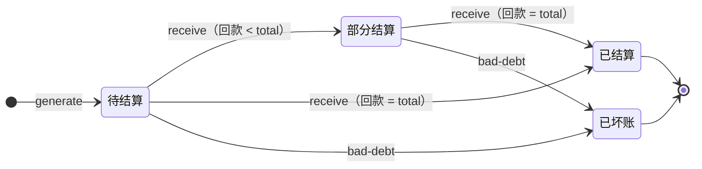

# 财务结算 · 调度运力 · IoT 逐项任务卡（第三 / 四 / 五梯队）

> 承接《需求文档 v2.4》（§5.4 后续迭代）：
> - **第三梯队（P1）财务结算**：FIN-1 运费结算对账 / FIN-2 司机趟次工资 / FIN-3 账期回款坏账 / FIN-4 每趟利润
> - **第四梯队（P1/P2）调度运力**：DSP-1 多约束路线规划（可解释）/ DSP-2 外协·加盟运力池 / DSP-3 抢派双模
> - **第五梯队（P2）IoT 增值（依赖硬件，按需）**：IOT-1 冷链温控 / IOT-2 重量·视频货损 / IOT-3 能源结算
>
> **前置必读**：`12-ClaudeCode开发纪律与红线.md`、`06-开发规范与需求规格说明书.md`（**结算/调度/运力的需求与业务规则以 SRS §6.5 结算计费(POD)、§6.2 智能调度(DSP)、§6.3 承运商运力(CAP) 为准**，本卡只补实现细节与排期）、`09-多端数据打通与统一领域模型.md`、`20-运营可视化与成本管控任务卡.md`（OPS-4 已定义 `pd_task_cost`，**尚未落地建表**）、`13-UI设计规范与页面模板.md`。

---

## 0. 硬约束（不可违反）

- 后端按**全栈升级基线**推进（JDK 21 LTS + Spring Boot 3.5 + Spring Cloud 2025.0；依赖锁定在基线之上不擅自再加升级，安全 CVE 随升级解决）。（**2026-10-08 修订**：原"JDK1.8/不升级任何依赖/CVE不处理"已废止，以全栈升级为准。）
- **不引新中间件**：不用 MongoDB / Redis Stream / MQTT / XXL-JOB / ES / 专用求解器（如 OR-Tools）。
- **新建 MySQL 表允许**；能查询算出的一律不建表。
- IoT 设备上报**复用现有通道**：`pd-netty` 的 Netty + HTTP（`POST /netty/push`），**不引 MQTT**。
- 管理端按 **Vue3 升级专项**推进（Vue3 + Element Plus）；本卡财务页按新栈实现，既有页随专项迁移。
- 接口风格：`@RequestMapping("xxx")`（无前导斜杠）+ `@PostMapping("/page")`。
- **★新增接口三层落点约定（2026-10-06 自检补，全卡通用）**：本卡 FIN/DSP/IOT 新增接口定义在 `pd-oms`/`pd-work`/`pd-dispatch`/`pd-base` 等**内部服务**，但内部服务**网关无路由**（网关 `ignored-services:'*'`），前端不可直连。所有新增接口必须：
  1. **数据/服务层**：在业务内部服务实现（Feign 互调，如运费规则、VRP 求解）；
  2. **网关暴露层**：由 `pd-web-manager` 新建聚合 Controller 暴露，网关路径 `/api/web-manager/<模块>/*`（如 `/api/web-manager/freight-bill/*`、`/api/web-manager/payment/*`、`/api/web-manager/dispatch/*`、`/api/web-manager/iot/*`）；C 端查询类走 `pd-web-customer`；
  3. **权限注册**：接口注册进 `pd_auth.pd_auth_resource` 并绑定菜单角色（阻断 C，见《联调就绪检查清单》§2），否则网关判"未知请求"拒绝。
  **禁止**把内部服务路径（如 `pd-oms /pay/*`）直接写进前端 API 配置——必 404 或被网关拒。

### ⚠️ 关于"外协运力池"的红线澄清（必须先读）
用户已明确**不对接任何外部厂商/三方物流 API**。
**DSP-2 外协运力池 = 把加盟/外协的车和人"录入本系统"进行统一管理**（建档、派单、结算），
**≠ 调用外部厂商系统接口**（不对接顺丰/三通一达/EDI/ERP/外部平台 API）。
实现时**只允许本系统内部 CRUD + 内部派单**，禁止任何对外接口调用。

---

## 1. 现状核对小结

| 域 | 现状 | 结论 |
|---|---|---|
| 运费计算 | ✅ **Drools 运费规则已有**（`orderAmountCalc.drl` + `OrderServiceImpl#calculateAmount`（`:239`，注意方法名不是 `calculateOrderAmount`）内联 KieSession，支持热加载 `ReloadDroolsRulesService` / `RulesReloadController`）。🔴 **订正 2026-10-09**：原判"`DroolsRulesServiceImpl#calcFee` 是死代码（无调用方）"**有误**——它被 `.drl` 的 `then` 块调用（`orderAmountCalc.drl:33/50/67`），Java 侧 grep 看不到该引用；**禁止清理**。唯一死代码是其 `main`（`DroolsRulesServiceImpl.java:34-42`）。算价口径逐条见《52》§1 | 复用，但**计费明细未落库**；附加费按 SRS §6.5 POD-03 扩展现有规则（**不升级 Drools**） |
| 订单金额 | ✅ `Order.amount`、`paymentMethod`(1预结/2到付)、`paymentStatus`(1未付/2已付) | 有字段，无结算流程 |
| 结算/对账/账单 | 🟡 **应收结算单服务层已有**（`SettlementServiceImpl#settle/doSettle` 含幂等 + `SettlementOrder` 实体 + 事件入口 `SettlementDeliveredListener`，**但无对外 Controller、对账逻辑未实现**）；司机工资/账单/坏账**零实现** | 应收侧已通，须补对外接口 + 对账(POD-04)/司机结算(POD-05) |
| 趟次成本 | ⚠️ OPS-4 已**定义** `pd_task_cost`，全仓无 DDL、无实体 → 需先建表 | 利润 = 收入 − 成本 |
| 调度链路 | ✅ **`DispatchTask` 5 阶段明确**：订单分类 → **路线规划 `ITaskRoutePlanningService`（实现 `TaskRoutePlanningServiceImpl`）** → 创建运输任务 → 车次车辆司机 `ITaskTripsSchedulingService` → 完善任务+司机作业；用 `@GlobalTransactional`(Seata) | **VRP 升级落点 = `TaskRoutePlanningServiceImpl`** |
| 车辆载重/体积 | ✅ `PdTruck.allowableLoad / allowableVolume`、`PdTruckType` | 多约束 VRP 的约束条件已具备 |
| 线路/车次 | ✅ `PdTransportLine`、`PdTransportTrips`、`PdTransportTripsTruckDriver` | 可复用 |
| 外协/承运商 | ❌ 无实体 | 需建表 |
| 状态机 | ✅ **`StateTransitionValidator` 已完备且已被调用** | **严禁新建/重写状态机**（见《多端数据打通》§3.2 修正） |
| IoT（温控/重量/能源） | ❌ 完全无 | P2，依赖硬件投入 |

---

# 第三梯队：财务结算（P1）

> 对标 G7 财运通"订单/车辆/运力三大利润中心打通、盈亏实时可见"；通用 TMS 的运费审计与结算。
> **解决**：品达财务侧完全空白 —— 不算账、不对账、不结算。

## FIN-1 运费结算与对账

### 新建表
```sql
-- 客户运费账单（对客户/加盟方的应收账单）
CREATE TABLE pd_freight_bill (
  id            VARCHAR(64) NOT NULL COMMENT '主键',
  bill_no       VARCHAR(64) NOT NULL COMMENT '账单号',
  member_id     VARCHAR(64) NOT NULL COMMENT '客户id',
  period_start  DATE        NOT NULL COMMENT '账期开始',
  period_end    DATE        NOT NULL COMMENT '账期结束',
  order_count   INT         NOT NULL DEFAULT 0 COMMENT '运单数',
  total_amount  DECIMAL(14,2) NOT NULL DEFAULT 0 COMMENT '应收总额',
  paid_amount   DECIMAL(14,2) NOT NULL DEFAULT 0 COMMENT '已收金额',
  status        INT         NOT NULL DEFAULT 0 COMMENT '0待结算 1部分结算 2已结算 3已坏账',
  due_date      DATE        NULL COMMENT '到期日',
  remark        VARCHAR(255) NULL,
  create_time   DATETIME    NOT NULL,
  PRIMARY KEY (id),
  UNIQUE KEY uk_bill_no (bill_no),
  KEY idx_member (member_id),
  KEY idx_status_due (status, due_date)
) ENGINE=InnoDB DEFAULT CHARSET=utf8mb4 COMMENT='客户运费账单';

-- 账单明细（按订单/运单逐条，支持对账争议追溯）
CREATE TABLE pd_freight_bill_detail (
  id                VARCHAR(64) NOT NULL,
  bill_id           VARCHAR(64) NOT NULL COMMENT '账单id',
  order_id          VARCHAR(64) NULL COMMENT '订单id',
  transport_order_id VARCHAR(64) NULL COMMENT '运单id',
  base_freight      DECIMAL(12,2) NULL COMMENT '基础运费',
  extra_freight     DECIMAL(12,2) NULL COMMENT '附加费(保价/上楼/超区等)',
  adjust_amount     DECIMAL(12,2) NULL COMMENT '调整金额(争议后调整)',
  amount            DECIMAL(12,2) NOT NULL COMMENT '小计',
  create_time       DATETIME    NOT NULL,
  PRIMARY KEY (id),
  KEY idx_bill (bill_id),
  KEY idx_order (order_id)
) ENGINE=InnoDB DEFAULT CHARSET=utf8mb4 COMMENT='运费账单明细';
```

### 接口（`@RequestMapping("freight-bill")`）
| 方法 | 路径 | 说明 |
|---|---|---|
| POST | `/freight-bill/generate` | 按客户+账期生成账单（归集期内已完成订单） |
| POST | `/freight-bill/page` | 账单分页（客户/状态/到期日筛选） |
| GET | `/freight-bill/{id}` | 账单详情 + 明细 |
| POST | `/freight-bill/{id}/adjust` | 争议调账（写 `adjust_amount`，留痕） |
| GET | `/freight-bill/reconcile` | **对账视图**：账单 vs 运单 vs 支付记录差异 |

### 要点
- **计费明细落库**：把 Drools 算出的运费结果**持久化**到明细（现状只算不存，无法对账追溯）。
- 调账必须留痕，禁止直接改原金额。

### 合规约束（R10-1 · P1 · 依据《合规开发优先级清单》#16 /《物流行业合规与监管要求》R10）
- **运价透明可查**：运费计算规则（Drools 规则）须对司机/客户**透明展示**，结算单含计费明细（基础运费 + 附加项），禁止暗箱；呼应 §10.4 价格固化。
- **运费保障**：支持结算保障 / 垫付机制（COD / 月结账期），司机结算单（FIN-2）与回款（FIN-3）闭环，避免运费拖欠争议。
- 上述费率/结算规则变更须**留痕可审计**（呼应 R6-3 审计）。

### FIN-1.0a 应收 / 应付双账（P2 扩展 · 参照 EvolveTMS/BCKFreight · 2026-10-07 并入）

> 现状 `pd_freight_bill` 是**应收（客户/加盟方）**；承运商应付（外协运费）在 DSP-2 提到"走 FIN-1 账单"但无独立应付表。补**应付侧**视图，应收/应付分开建模（EvolveTMS 模式）：

- **新表（P2，pd-work 库）**：`pd_carrier_payable`（承运商应付账单：carrier_id / 账期 / 趟次 / 应付总额 / 已付金额 / 状态 0待结算 1部分结算 2已结算 / 到期日 / 备注）+ 明细 `pd_carrier_payable_detail`（task_transport_id / 应付运费 / 扣款(货损/晚点) / 补贴 / 小计）。
- **接口**（归 FIN-1 或 DSP-2 `@RequestMapping("freight-bill")`，P2）：`/freight-bill/payable/generate`（按承运商+账期生成）、`/freight-bill/payable/page`、`/freight-bill/payable/{id}/pay`（登记付款）。
- **联动**：承运商对账确认走 L-1 承运商端门户（`/carrier/settlement/statement`）；扣款依据 N-6 KPI/货损异常，留痕可审计。
- **DoD**：应收/应付两账分开查询与导出；付款登记留痕；不引新中间件。

#### FIN-1.0a-EXT 运费审计（FA-1，**P1** · 对标 MercuryGate/Blue Yonder · 2026-10-07 第三轮并入）
> 结算闭环关键环节：系统算费金额（rated）与承运商实际开票金额（invoiced）自动比对，差异超阈值转争议，杜绝"票多少付多少"。
- **字段扩展（不新增表）**：`pd_carrier_payable_detail` 加 `rated_amount`（系统算费）、`invoiced_amount`（发票金额，取 pd_invoice）、`diff_amount`（差额=invoiced-rated）、`audit_status`（0未审计 1一致 2有差异 3争议中 4已裁决）。
- **规则（yml 可配）**：`|diff_rate| ≤ 阈值（默认 2%）` 判一致；超阈值 audit_status=2 并生成差异记录；差异由财务复核（裁决按 rated 或 invoiced，填裁决原因）。
- **接口**（`freight-bill`）：`/freight-bill/payable/audit`（批量比对）、`/freight-bill/payable/diff/page`（差异列表）、`/freight-bill/payable/diff/{id}/resolve`（裁决）。
- **DoD**：明细可查算费/发票/差额；超阈值自动标差异；裁决留痕；不新增表、不引新组件。

### FIN-1.1 客户价格协议（P1 扩展 · 对标 G7 财运通结算 · 2026-10-06 并入）

> **解决**：B 端客户（企业/月结）没有专属计价，只能吃默认 Drools 规则 → 无法谈价、无法月结对账。

```sql
CREATE TABLE pd_price_agreement (
  id            VARCHAR(64) NOT NULL,
  member_id     VARCHAR(64) NOT NULL COMMENT '客户id（月结/企业客户）',
  line_id       VARCHAR(64) NULL COMMENT '线路id（空=全线路）',
  goods_type_id VARCHAR(64) NULL COMMENT '货物类型id（空=全部）',
  weight_min    DECIMAL(10,2) NULL COMMENT '重量段下限(kg)',
  weight_max    DECIMAL(10,2) NULL COMMENT '重量段上限(kg)',
  price_type    INT NOT NULL COMMENT '计价方式 1按票 2按吨 3按方',
  price         DECIMAL(12,2) NOT NULL COMMENT '单价',
  discount      DECIMAL(5,2) NOT NULL DEFAULT 1.00 COMMENT '月结折扣(0.90=9折)',
  effective_from DATE NOT NULL,
  effective_to   DATE NULL,
  status        INT NOT NULL DEFAULT 1 COMMENT '1生效 0停用',
  create_time   DATETIME NOT NULL,
  PRIMARY KEY (id),
  KEY idx_member (member_id)
) ENGINE=InnoDB DEFAULT CHARSET=utf8mb4 COMMENT='客户价格协议';
```

- **计费衔接**：Drools 计算前先查客户有效协议（member_id+线路+货物类型+重量段命中）→ **命中走协议价，未命中走默认规则**；协议变更留痕（R10-1 透明可查）。
- **接口**（归 FIN-1 `@RequestMapping("freight-bill")` 扩展）：`POST /price-agreement`（增改）、`GET /price-agreement/page`、`POST /price-agreement/{id}/disable`。
- **管理端页**：客户管理 → 价格协议（`pinda/customer/priceAgreement`，P1）。

### FIN-1.2 电子发票（P1 扩展 · 对标 G7 财运通结算 · 2026-10-06 并入）

> **解决**：对账后要开票，现无发票记录。**测试/开发环境不接真实税控**（税盘/百望等外部对接属"外部厂商 API"边界，不实现），只做申请-开具-邮寄状态管理。

```sql
CREATE TABLE pd_invoice (
  id            VARCHAR(64) NOT NULL,
  invoice_no    VARCHAR(64) NULL COMMENT '发票号（税控开具后回填；测试环境自编）',
  bill_id       VARCHAR(64) NOT NULL COMMENT '关联账单（FIN-1）',
  member_id     VARCHAR(64) NOT NULL,
  amount        DECIMAL(14,2) NOT NULL,
  type          INT NOT NULL DEFAULT 1 COMMENT '1增值税普票 2增值税专票',
  status        INT NOT NULL DEFAULT 1 COMMENT '1待申请 2已申请 3已开具 4已邮寄 5已作废',
  tax_no        VARCHAR(64) NULL COMMENT '客户税号',
  mail_address  VARCHAR(255) NULL COMMENT '邮寄地址',
  create_time   DATETIME NOT NULL,
  invoice_time  DATETIME NULL,
  PRIMARY KEY (id),
  KEY idx_bill (bill_id)
) ENGINE=InnoDB DEFAULT CHARSET=utf8mb4 COMMENT='电子发票';
```

- **接口**（归 FIN-1 扩展）：`POST /invoice/apply`（按账单申请）、`POST /invoice/{id}/issue`（标记开具，测试环境自编发票号）、`POST /invoice/{id}/mail`（邮寄）、`GET /invoice/page`。
- **不做**：不接真实税控开票（边界条款）；不做发票真伪查验。

## FIN-2 司机趟次工资结算

### 新建表
```sql
CREATE TABLE pd_driver_settlement (
  id            VARCHAR(64) NOT NULL,
  settle_no     VARCHAR(64) NOT NULL COMMENT '结算单号',
  driver_id     VARCHAR(64) NOT NULL,
  period_start  DATE NOT NULL,
  period_end    DATE NOT NULL,
  trip_count    INT  NOT NULL DEFAULT 0 COMMENT '完成趟次',
  base_wage     DECIMAL(12,2) NULL COMMENT '底薪',
  trip_fee      DECIMAL(12,2) NULL COMMENT '趟次费合计',
  allowance     DECIMAL(12,2) NULL COMMENT '补贴(油补/过路/餐补)',
  deduction     DECIMAL(12,2) NULL COMMENT '扣款(违章/货损/迟到)',
  total_amount  DECIMAL(12,2) NOT NULL COMMENT '应发合计',
  status        INT NOT NULL DEFAULT 0 COMMENT '0待审 1已审 2已发放',
  create_time   DATETIME NOT NULL,
  PRIMARY KEY (id),
  UNIQUE KEY uk_settle_no (settle_no),
  KEY idx_driver (driver_id)
) ENGINE=InnoDB DEFAULT CHARSET=utf8mb4 COMMENT='司机结算单';

CREATE TABLE pd_driver_settlement_detail (
  id               VARCHAR(64) NOT NULL,
  settlement_id    VARCHAR(64) NOT NULL,
  task_transport_id VARCHAR(64) NULL COMMENT '趟次(运输任务)id',
  driver_job_id    VARCHAR(64) NULL,
  amount           DECIMAL(12,2) NOT NULL COMMENT '该趟金额',
  remark           VARCHAR(255) NULL,
  create_time      DATETIME NOT NULL,
  PRIMARY KEY (id),
  KEY idx_settle (settlement_id),
  KEY idx_task (task_transport_id)
) ENGINE=InnoDB DEFAULT CHARSET=utf8mb4 COMMENT='司机结算明细(按趟次)';
```

### 接口（`@RequestMapping("driver-settlement")`）
| 方法 | 路径 | 说明 |
|---|---|---|
| POST | `/driver-settlement/generate` | 按司机+周期生成（归集 `DriverJob.status=4` 的趟次） |
| POST | `/driver-settlement/page` | 结算单分页 |
| GET | `/driver-settlement/{id}` | 详情 + 逐趟明细 |
| POST | `/driver-settlement/{id}/audit` | 审核 / 发放 |
| GET | `/driver-settlement/driver/{driverId}` | 某司机历史结算 |

### 要点
- **趟次是司机结算天然单位**（`DriverJob.taskTransportId`），按趟归集。
- 趟次费规则（每趟多少钱/按里程/按重量）**配置化进 yml 或字典**，禁止硬编码。

## FIN-3 账期 / 回款 / 坏账预警

### 新建表
```sql
-- 客户账期与信用
CREATE TABLE pd_customer_credit (
  id                VARCHAR(64) NOT NULL,
  member_id         VARCHAR(64) NOT NULL COMMENT '客户id',
  credit_period_days INT NOT NULL DEFAULT 0 COMMENT '账期天数',
  credit_limit      DECIMAL(14,2) NULL COMMENT '信用额度',
  used_amount       DECIMAL(14,2) NOT NULL DEFAULT 0 COMMENT '已用额度',
  risk_level        INT NOT NULL DEFAULT 0 COMMENT '0正常 1关注 2预警 3黑名单',
  create_time       DATETIME NOT NULL,
  PRIMARY KEY (id),
  UNIQUE KEY uk_member (member_id)
) ENGINE=InnoDB DEFAULT CHARSET=utf8mb4 COMMENT='客户账期与信用';

-- 收付款流水（应收登记 / 回款 / 坏账核销）
CREATE TABLE pd_payment_record (
  id          VARCHAR(64) NOT NULL,
  bill_id     VARCHAR(64) NULL COMMENT '关联账单',
  type        INT NOT NULL COMMENT '1应收登记 2回款 3坏账核销 4退款',
  amount      DECIMAL(14,2) NOT NULL,
  pay_method  INT NULL COMMENT '1现金 2转账 3在线支付 4到付核销',
  occur_time  DATETIME NOT NULL,
  operator    VARCHAR(64) NULL,
  remark      VARCHAR(255) NULL,
  create_time DATETIME NOT NULL,
  PRIMARY KEY (id),
  KEY idx_bill (bill_id),
  KEY idx_occur (occur_time)
) ENGINE=InnoDB DEFAULT CHARSET=utf8mb4 COMMENT='收付款流水';
```

### 接口（`@RequestMapping("payment")`）
| 方法 | 路径 | 说明 |
|---|---|---|
| POST | `/payment/receive` | 回款登记（回写账单 `paid_amount` 与状态） |
| POST | `/payment/bad-debt` | 坏账核销 |
| GET | `/payment/aging` | **应收账龄报表**（0-30/31-60/61-90/90+ 天） |
| GET | `/payment/overdue` | 逾期账单列表（触发预警） |

### 要点
- 逾期预警：每天 `@Scheduled` 扫 `due_date < now 且 status != 2` 的账单 → 写告警（`pd_alarm_record` 扩 `bizType=BILL`）或站内通知。
- **超信用额度时拦截下单**（可选，配置开关）。

## FIN-4 每趟 / 每单利润（"老板看数"）

### 不建表 —— 查询计算
```
趟次利润 = Σ(该趟关联订单 Order.amount)  −  Σ(pd_task_cost where task_transport_id)
订单利润 = Order.amount − 分摊成本
```
数据来源：`pd_task_cost`（OPS-4）+ `TransportOrderTask` → `TransportOrder.orderId` → `Order.amount`。

### 接口（`@RequestMapping("profit")`）
| 方法 | 路径 | 说明 |
|---|---|---|
| GET | `/profit/task/{taskId}` | 单趟利润（收入、成本明细、毛利、毛利率） |
| GET | `/profit/order/{orderId}` | 单订单利润 |
| GET | `/profit/summary` | 利润汇总（按车队/车辆/线路/月份，支持排序找亏损线） |
| GET | `/profit/ranking` | 线路/车辆利润排行（找出最赚与最亏） |
| GET | `/profit/drill/{dimension}` | **联动钻取（P1 · 承接 OPS-4 §6.7）**：dimension=order/truck/line/fleet，订单→车辆→趟次→利润逐层下钻 |

### 要点
- **V1 只做毛利**（收入 − 直接成本），不做分摊间接成本（避免过度设计）。
- 管理端**利润驾驶舱页**：卡片 + 排行（对标 G7"打开老板看数就能看到利润"）。
- **移动端老板视图（P1 扩展 · 2026-10-06 并入）**：复用司机端 App（admin 角色可见）或管理端 H5 适配，**只看 KPI**（今日业务量 / 毛利 / 在途异常数 / 成本占比 / 亏损线 Top3），调 `/profit/summary` + `/profit/ranking`，**不做明细操作**。

---

# 第四梯队：调度与运力（P1/P2）

## DSP-1 多约束路线规划（可解释）

### 目标
现状 DFS 路径规划**过程黑盒不可解释**（已知痛点）。对标满帮/货拉拉/G7 的智能调度。

### 落点（已确认）
**`pd-dispatch` 的 `TaskRoutePlanningServiceImpl`**（`DispatchTask` 第 2 阶段调用）。第 4 阶段 `ITaskTripsSchedulingService` 负责车次/车辆/司机匹配。

### 升级：从 DFS → 多约束启发式（**不引求解器依赖**）
约束（数据均已具备）：
| 约束 | 数据来源 |
|---|---|
| 车型匹配 | `PdTruckType`、`PdTruck.truckTypeId` |
| 载重 | `PdTruck.allowableLoad` vs 货物 `OrderCargo.totalWeight` |
| 体积 | `PdTruck.allowableVolume` vs `OrderCargo.totalVolume` |
| 时效 | `TaskTransport.planArrivalTime` / 线路时长 `PdTransportLine` |
| 多点取送 | `OrderLocation` / 订单收发地址 |
| 司机资质 | `PdTruckDriverLicense`、`PdTruckDriver.drivingAge` |

**算法建议（JDK21 纯 Java，零新依赖；2026-10-10 修订：随全栈升级基线由 JDK8 改为 JDK21）**：
1. 先按约束做**可行性剪枝**（车型/载重/体积/时效不达标直接排除）。
2. DFS/贪心构造初始解 → **局部搜索改进**：2-opt（路径内换位）+ 插入法（订单换线）。
3. **保留可解释性**：每一步决策记录原因。

### 新增表（可解释性，解决"黑盒"痛点）
```sql
CREATE TABLE pd_dispatch_decision_log (
  id           VARCHAR(64) NOT NULL,
  job_id       VARCHAR(64) NULL COMMENT '调度任务id',
  business_id  VARCHAR(64) NULL COMMENT '机构id',
  order_id     VARCHAR(64) NULL,
  stage        VARCHAR(32) NOT NULL COMMENT 'CLASSIFY分类 ROUTE路线 TRUKSCHED车次调度',
  decision     VARCHAR(255) NOT NULL COMMENT '决策结果(选了哪条线/哪辆车)',
  reason       VARCHAR(512) NULL COMMENT '决策原因(约束命中/成本最低/时效最优)',
  rejected     VARCHAR(512) NULL COMMENT '被否决项及原因',
  create_time  DATETIME NOT NULL,
  PRIMARY KEY (id),
  KEY idx_job (job_id),
  KEY idx_order (order_id)
) ENGINE=InnoDB DEFAULT CHARSET=utf8mb4 COMMENT='调度决策日志(可解释)';
```

### 接口
| 方法 | 路径 | 说明 |
|---|---|---|
| GET | `/dispatch/decision/{jobId}` | 某次调度的决策过程（管理端"为什么这么调度"） |
| POST | `/dispatch/simulate` | **调度试算**（不落库，对比不同参数结果） |

### 红线
- **禁止引入 OR-Tools / 任何求解器依赖**（不引新中间件/新依赖；⚠️ 2026-10-08 订正：原文以"不升级技术栈"作理由，该口径已废止，现行约束是"按升级基线迁移、但不引路线图外的新依赖"）。
- **禁止为了"智能"牺牲可解释性** —— 每条调度决策必须能说出原因。
- 不改动 `DispatchTask` 的 5 阶段结构与 `@GlobalTransactional`。

## DSP-2 外协 / 加盟运力池

> ⚠️ **红线**：仅"录入本系统管理"，**禁止调用任何外部厂商 API**。

### 新建表
```sql
CREATE TABLE pd_carrier (
  id           VARCHAR(64) NOT NULL COMMENT '承运商/外协id',
  code         VARCHAR(64) NOT NULL COMMENT '编码',
  name         VARCHAR(128) NOT NULL COMMENT '名称',
  contact_name VARCHAR(64) NULL,
  contact_phone VARCHAR(32) NULL,
  settle_type  INT NULL COMMENT '结算方式 1现结 2月结 3趟结',
  status       INT NOT NULL DEFAULT 1 COMMENT '0禁用 1正常',
  remark       VARCHAR(255) NULL,
  create_time  DATETIME NOT NULL,
  PRIMARY KEY (id),
  UNIQUE KEY uk_code (code)
) ENGINE=InnoDB DEFAULT CHARSET=utf8mb4 COMMENT='承运商/外协(加盟运力主体)';

CREATE TABLE pd_carrier_truck (
  id          VARCHAR(64) NOT NULL,
  carrier_id  VARCHAR(64) NOT NULL COMMENT '所属承运商',
  license_plate VARCHAR(32) NOT NULL COMMENT '车牌',
  truck_type_id VARCHAR(64) NULL,
  allowable_load DECIMAL(12,2) NULL,
  allowable_volume DECIMAL(12,2) NULL,
  status      INT NOT NULL DEFAULT 1 COMMENT '0禁用 1正常 2在途',
  create_time DATETIME NOT NULL,
  PRIMARY KEY (id),
  KEY idx_carrier (carrier_id)
) ENGINE=InnoDB DEFAULT CHARSET=utf8mb4 COMMENT='外协车辆';

CREATE TABLE pd_carrier_driver (
  id          VARCHAR(64) NOT NULL,
  carrier_id  VARCHAR(64) NOT NULL,
  name        VARCHAR(64) NOT NULL,
  phone       VARCHAR(32) NULL,
  license_no  VARCHAR(64) NULL COMMENT '驾驶证号',
  status      INT NOT NULL DEFAULT 1 COMMENT '0禁用 1正常 2在途',
  create_time DATETIME NOT NULL,
  PRIMARY KEY (id),
  KEY idx_carrier (carrier_id)
) ENGINE=InnoDB DEFAULT CHARSET=utf8mb4 COMMENT='外协司机';
```

### 接口（`@RequestMapping("carrier")`）
| 方法 | 路径 | 说明 |
|---|---|---|
| POST/GET/PUT | `/carrier`、`/carrier/{id}` | 承运商 CRUD |
| GET | `/carrier/{id}/trucks`、`/carrier/{id}/drivers` | 外协车辆/司机列表 |
| GET | `/carrier/capacity` | **可用运力池查询**（按车型/载重/区域筛选空闲外协车） |
| POST | `/carrier/dispatch` | 派单给外协（生成运输任务，标记来源=外协） |

### 要点
- `TaskTransport` 需区分**自营/外协**（可加 `carrier_id` 字段，为空即自营）。
- 外协结算走 FIN-1 的账单（对承运商的应付）。

### 承运商 KPI 考核（P1 扩展 · 行业基准：教材 TMS/芸柚/HashMicro · 2026-10-06 并入）

> **解决**：外协车"谁准时率高、谁货损多、谁异常多"无量化，靠感觉；KPI 考核给派单决策与结算（续约/淘汰）数据支撑。

- **指标**（纯统计查询，零表改动）：准时率（任务实际到达 vs 计划到达）、货损率（异常货损件数/总件数）、异常率（`pd_alarm_record` 按承运商聚合）、月完成趟次。
- **接口**（归 DSP-2 `@RequestMapping("carrier")` 扩展，P1）：`GET /carrier/{id}/kpi`（单承运商考核卡）、`GET /carrier/kpi/list`（承运商考核对比表，支持按月筛选）。
- **落点**：管理端承运商管理页加"考核"入口；考核结果仅展示，不做自动封禁（避免误伤，红线保留人工判定）。
- **DoD**：指标口径可解释（在接口文档注明计算公式）；可按月/承运商筛选；不建新表。

### 承运商端自助门户（P1 扩展 · 参照联云 SLMS 承运商端 · 2026-10-06 并入）

> **解决**：外协承运商（加盟）接单/节点确认/回单/对账全在微信电话里来回，无自助入口。联云把承运商端做成了独立产品线（SLMS：全部运单/未指派/待调度/已调度/待称重/已交接/已装车/运输中/到达签收/已签收/异常闭环/黑名单记录）。G7 亦强调外协"统一管理、可控运力池"。本项目 DSP-2 已有外协池，补**承运商端入口**即闭环。

- **形态（P1）**：司机端 App 增加"承运商"身份（复用统一账号体系，外协司机登录即承运商视图），不新开发独立 App——承运商/外协司机看到：**待接单任务（接/拒）→ 节点确认（装车/在途/到达/签收，同司机端节点）→ 回单上传（复用 POD）→ 运费对账（应收对账单确认，复用 FIN-1 账单）**。
- **接口**（归 DSP-2 `@RequestMapping("carrier")`，P1）：`GET /carrier/task/list`（待接单任务）、`POST /carrier/task/{id}/accept|reject`（接/拒单）、`GET /carrier/settlement/statement`（承运商应收对账单）。
- **权限**：`pd_auth_resource` 新增承运商角色（复用 driver 角色扩展或新增 `CARRIER`），路由走 `/api/web-driver` 承运商视图。
- **不做**：独立承运商门户系统（SLMS 级）、承运商入驻审批流（P2 再议）。

### 承运商黑名单记录（P2 扩展 · 参照联云 SLMS 黑名单 · 2026-10-06 并入）

- 在 DSP-2 KPI 基础上，管理端可**人工拉黑/备注**承运商（原因+时间+操作人，入 `pd_carrier` 扩展字段或新表 `pd_carrier_blacklist`）；调度派单时黑名单承运商不出现在 `/carrier/capacity` 候选；仅人工判定，不自动封禁（红线）。
- **DoD**：黑名单可增删查；拉黑后调度候选自动排除；操作留痕。

## DSP-3 抢派双模

### 新建表
```sql
CREATE TABLE pd_task_grab_record (
  id               VARCHAR(64) NOT NULL,
  task_transport_id VARCHAR(64) NOT NULL COMMENT '运输任务id',
  driver_id        VARCHAR(64) NOT NULL COMMENT '抢单司机',
  grab_time        DATETIME NOT NULL,
  result           INT NOT NULL DEFAULT 0 COMMENT '0抢单成功 1被抢走 2取消',
  create_time      DATETIME NOT NULL,
  PRIMARY KEY (id),
  UNIQUE KEY uk_task_driver (task_transport_id, driver_id),
  KEY idx_task (task_transport_id)
) ENGINE=InnoDB DEFAULT CHARSET=utf8mb4 COMMENT='司机抢单记录';
```

### 接口（`@RequestMapping("dispatch-assign")`）
| 方法 | 路径 | 说明 |
|---|---|---|
| GET | `/dispatch-assign/mode` | 获取派单模式（自动派 / 抢单，按机构配置） |
| POST | `/dispatch-assign/mode` | 配置派单模式 |
| GET | `/dispatch-assign/pool` | **抢单池**（司机端：可抢任务列表） |
| POST | `/dispatch-assign/grab` | 司机抢单（并发控制：同一任务只允许一人成功） |

### 要点
- 并发控制：抢单用**数据库唯一键 `uk_task_driver` + 条件更新**控制，不用分布式锁（不引中间件）。
- 抢单成功后更新 `DriverJob` 与 `TaskTransport.assignedStatus`。

---

# 第五梯队：IoT 增值（P2，依赖硬件，按需）

> **前提**：需采购/配备相应硬件。**无硬件则本期不做**。
> **上报通道统一复用 `pd-netty` 的 Netty + HTTP（`POST /netty/push`），不引 MQTT。**

## IOT-1 冷链温控
```sql
CREATE TABLE pd_iot_temperature (
  id            VARCHAR(64) NOT NULL,
  truck_id      VARCHAR(64) NULL COMMENT '车辆id',
  task_transport_id VARCHAR(64) NULL COMMENT '运输任务id',
  temperature   DECIMAL(5,2) NOT NULL COMMENT '温度(℃)',
  humidity      DECIMAL(5,2) NULL COMMENT '湿度',
  device_time   DATETIME NOT NULL COMMENT '设备采集时间',
  create_time   DATETIME NOT NULL,
  PRIMARY KEY (id),
  KEY idx_task (task_transport_id),
  KEY idx_truck_time (truck_id, device_time)
) ENGINE=InnoDB DEFAULT CHARSET=utf8mb4 COMMENT='冷链温控记录';
```
- 阈值配置进 yml（如 2~6℃），超阈值 → 告警类型 `TEMP_ABNORMAL`（写入 `pd_alarm_record`，复用 OPS-0 告警中心）。
- 接口：`POST /iot/temperature/report`（上报）、`GET /iot/temperature/task/{taskId}`（曲线 + 超标点）。
- 前端：温度曲线图（管理端 ECharts）+ 司机端超标提醒。

## IOT-2 重量 / 视频货损监控
```sql
CREATE TABLE pd_iot_weight (
  id            VARCHAR(64) NOT NULL,
  truck_id      VARCHAR(64) NULL,
  task_transport_id VARCHAR(64) NULL,
  weight        DECIMAL(12,2) NOT NULL COMMENT '重量(kg)',
  device_time   DATETIME NOT NULL,
  create_time   DATETIME NOT NULL,
  PRIMARY KEY (id),
  KEY idx_task (task_transport_id)
) ENGINE=InnoDB DEFAULT CHARSET=utf8mb4 COMMENT='载重监控记录';
```
- 异常判定：装货后/运输中重量骤降 → 告警 `WEIGHT_ABNORMAL`（防盗/防货损）。
- **视频复用已规划的司机视频能力（VID）**，不另起视频系统。
- **合规约束（R2-4 · P1 · 依据《合规开发优先级清单》#9 /《物流行业合规与监管要求》R2/R11）**：司机视频（盲区预警 / 驾驶员状态）数据须**直传监管平台或本平台**，不得经不可控的中间转发环节（GB/T 28181 / JT/T 1078 国标接入，或云厂商 RTC 直传）。视频/状态结果落库用于 OPS-5 驾驶行为分析，但**原始视频流路径须可审计、不落地到非授权节点**。
- 接口：`POST /iot/weight/report`、`GET /iot/weight/task/{taskId}`。

## IOT-3 能源（油卡 / 加油）结算
- 复用 OPS-4 的 `pd_truck_fuel`（加油记录），扩展字段区分**油卡/现金**。
```sql
-- 在 pd_truck_fuel 上扩展（或新建油卡表）
CREATE TABLE pd_fuel_card (
  id           VARCHAR(64) NOT NULL,
  card_no      VARCHAR(64) NOT NULL COMMENT '油卡号',
  truck_id     VARCHAR(64) NULL,
  carrier_id   VARCHAR(64) NULL COMMENT '承运商(外协)',
  balance      DECIMAL(12,2) NOT NULL DEFAULT 0 COMMENT '余额',
  status       INT NOT NULL DEFAULT 1 COMMENT '0禁用 1正常',
  create_time  DATETIME NOT NULL,
  PRIMARY KEY (id),
  UNIQUE KEY uk_card (card_no)
) ENGINE=InnoDB DEFAULT CHARSET=utf8mb4 COMMENT='油卡';
```
- 加油记录关联油卡 → 与加油站/油卡对账（`GET /fuel/reconcile`）。
- **前提**：需与加油站或油卡服务商有合作；无合作则不做。

---

## 2. 新建表 DDL 汇总

| 表 | 库 | 用途 | 梯队 |
|---|---|---|---|
| `pd_freight_bill` / `pd_freight_bill_detail` | pd-work(或新建财务库) | 客户运费账单与明细 | FIN-1 |
| `pd_driver_settlement` / `pd_driver_settlement_detail` | 同上 | 司机趟次结算 | FIN-2 |
| `pd_customer_credit` / `pd_payment_record` | 同上 | 账期信用、收付款流水 | FIN-3 |
| （FIN-4 利润 **不建表**，查询计算） | — | — | FIN-4 |
| `pd_dispatch_decision_log` | pd-dispatch | 调度决策可解释日志 | DSP-1 |
| `pd_carrier` / `pd_carrier_truck` / `pd_carrier_driver` | pd-base | 外协运力池 | DSP-2 |
| `pd_task_grab_record` | pd-work/pd-dispatch | 抢单记录 | DSP-3 |
| `pd_iot_temperature` | pd-netty | 冷链温控 | IOT-1 |
| `pd_iot_weight` | pd-netty | 载重监控 | IOT-2 |
| `pd_fuel_card` | pd-base | 油卡 | IOT-3 |

> 另：`TaskTransport` 建议加 `carrier_id`（区分自营/外协），为空即自营 —— **唯一建议的存量表加字段项**。

## 3. 验收 DoD

- [ ] 能按客户账期生成运费账单，明细可追溯到每单；支持调账留痕与对账视图。
- [ ] 能按司机生成趟次结算单（逐趟明细），支持审核发放。
- [ ] 应收账龄报表可出；逾期账单能触发预警。
- [ ] 能算出单趟/单订单毛利，管理端利润驾驶舱可见排行。
- [ ] 路线规划引入车型/载重/体积/时效约束，且**调度决策可解释**（决策日志可查）。
- [ ] 外协承运商/车辆/司机可建档并派单，**且未调用任何外部厂商 API**。
- [ ] 抢单池可用，同一任务并发只一人成功。
- [ ] IoT 三项**仅在硬件具备时**落地；上报走 `/netty/push`，未引 MQTT。
- [ ] **未新增任何中间件**，JDK 21 编译通过，未在升级基线之上额外升级依赖。
- [ ] 阈值与规则进配置，无硬编码。

## 4. 实施顺序

```
第三梯队（先做，财务闭环）
  FIN-1 运费结算 → FIN-2 司机结算 → FIN-3 账期回款 → FIN-4 利润驾驶舱(依赖 OPS-4 成本)

第四梯队
  DSP-1 多约束可解释路线规划（痛点：黑盒）
  → DSP-2 外协运力池（加盟模式需要）
  → DSP-3 抢派双模

第五梯队（按需，硬件具备才做）
  IOT-1 冷链温控 → IOT-2 重量视频货损 → IOT-3 能源结算
```

> 依赖提醒：**FIN-4 依赖 OPS-4（`pd_task_cost`）先完成**，否则无成本数据算不出利润。

---

# PRD 必选模块补全（P0-6 财务结算域 · 2026-10-07 补入）

> 本节承接 P0-5/P0-1/P0-2a 同款 PRD 方法论（参考 `product-doc-writing` skill 的 §3-§8 工作流），对 P0-6 财务结算域 4 子项（P0-6a 运费明细落库 / P0-6b 对账单生成 / P0-6c 账单与开票 / P0-6d 利润核算）补齐 PRD 五维识别、九维评分、Fintech 路由必选模块、14 项质量门禁。
> **路由结论**：Fintech-compliance + Enterprise SaaS 双路由 → Heavyweight 深度 → 必选模块全套（监管依据 / 权限矩阵 / 风控规则 / 审计日志 / 数据脱敏 / 异常补偿 / 用户披露）。

## §PRD-1 需求背景与量化痛点（Module 1）

### §PRD-1.1 业务背景与触发源

品达 TMS 财务侧目前完全空白：`Order.amount` / `paymentMethod` / `paymentStatus` 字段已有但无结算流程，全库搜索"结算 / 对账 / bill / 承运商"几乎无匹配实体，Drools 运费规则已落地（`DroolsRulesServiceImpl` + `ReloadDroolsRulesService` 热加载）但计费结果只算不存。业务链条断在"运费算出 → 入账 → 对账 → 开票 → 收款 → 利润"六步的第三步。

触发源来自三方面：① 销售侧谈月结客户时无法报价（无客户价格协议表）；② 财务月结对账靠 Excel 导出人工比对（无账单主表与明细表）；③ 司机工资靠车队主管手算（无趟次结算单）。三股压力共同指向"财务域必须建表 + 闭环"。

对标 G7 财运通"订单 / 车辆 / 运力三大利润中心打通、盈亏实时可见"，MercuryGate/Blue Yonder 的运费审计（rated vs invoiced 自动比对）。

### §PRD-1.2 量化痛点（4 项 · 已核实）

| 痛点 | 当前表现 | 业务影响 | 量化口径 |
|---|---|---|---|
| 计费只算不存 | Drools 运费结果不落 `pd_freight_bill_detail` | 对账无依据，争议无追溯 | 历史运单计费明细可追溯率 = 0% |
| 月结对账靠 Excel | 财务每月手工导出订单 + 运费 + 支付三方比对 | 月结周期 ≥3 工作日，差异率高 | 单客户月结对账工时 ≥8 小时，差异率 ≥5% |
| 司机工资手算 | 车队主管按趟次人工核算底薪 + 趟次费 + 补贴 + 扣款 | 易错易纠纷，发放延迟 | 单司机月度结算工时 ≥1 小时，差错率 ≥3% |
| 无利润报表 | 老板看不到哪条线 / 哪趟车赚亏 | 亏损线路无人管 | 月度亏损线路识别滞后 ≥30 天 |

### §PRD-1.3 不解决的后果

- 销售侧无法签月结企业客户（无价格协议 → 无差异化报价 → 只能吃默认 Drools 规则，毛利被压）。
- 财务侧每月对账工时随单量线性增长，单量翻倍即瓶颈。
- 资金侧应收账龄不可见，逾期 90+ 天账单无预警，坏账风险敞口不可控。
- 合规侧不满足 R10-1（运价透明可查）与 R6-3（审计留痕 ≥6 月），监管检查无法通过。

证据强度标注：`[Research-backed]` 痛点口径基于源码实测 + 行业基准对标（G7/MercuryGate/Blue Yonder 公开资料）；`[Hypothesis]` 单量翻倍即瓶颈为推断，需上线后用量化数据复核。

## §PRD-2 用户与角色权限矩阵（Module 3）

### §PRD-2.1 目标用户 Persona（6 类）

| 角色 | 主要场景 | 熟练度 | 使用频率 | 决策权 | 痛点严重度 |
|---|---|---|---|---|---|
| 财务专员 | 月结对账、回款登记、坏账核销 | 高（财务专业） | 每日 | 对账结论 + 坏账申请 | 极高 |
| 财务主管 | 调账裁决、发票审批、账期信用管理 | 高 | 每日 | 调账 + 发票审批 + 信用额度 | 极高 |
| 司机 | 查工资结算单、争议申诉 | 中（移动端） | 月度 | 申诉 | 高 |
| 客户（月结企业） | 查应收账单、申请发票、回款记录 | 中（C 端 H5） | 月度 | 申请发票 + 回款 | 高 |
| 承运商（外协） | 查应付账单、对账确认 | 中（司机端承运商视图） | 月度 | 对账确认 | 中 |
| 审计员 | 月度合规审计、留痕核查 | 高 | 月度 | 留痕判定 | 中 |

### §PRD-2.2 角色 × 操作 × 数据范围权限矩阵

| 操作 | 财务专员 | 财务主管 | 司机 | 客户 | 承运商 | 审计员 |
|---|---|---|---|---|---|---|
| 生成账单（应收） | ❌（仅执行） | ✅ | ❌ | ❌ | ❌ | ❌ |
| 账单分页查询 | 全部客户 | 全部客户 | ❌ | 自己的 | 自己的 | 全部 + 处理记录 |
| 调账（写 adjust_amount） | ❌ | ✅（填原因） | ❌ | ❌ | ❌ | ❌ |
| 调账裁决（运费审计 FA-1） | ❌ | ✅ | ❌ | ❌ | ❌ | ❌ |
| 回款登记 | ✅ | ✅ | ❌ | ❌ | ❌ | ❌ |
| 坏账核销 | 申请 | 审批 | ❌ | ❌ | ❌ | ❌ |
| 应收账龄报表 | ✅ | ✅ | ❌ | ❌ | ❌ | ✅（导出） |
| 司机结算单生成 | ❌ | ✅ | ❌ | ❌ | ❌ | ❌ |
| 司机结算单查询 | 全部 | 全部 | 自己的 | ❌ | ❌ | 全部 |
| 司机结算审核 / 发放 | ❌ | ✅ | ❌ | ❌ | ❌ | ❌ |
| 发票申请 | ❌ | ❌ | ❌ | ✅（自己的账单） | ❌ | ❌ |
| 发票开具 / 邮寄 | ❌ | ✅ | ❌ | ❌ | ❌ | ❌ |
| 利润驾驶舱 | ✅（只读） | ✅（只读） | ❌ | ❌ | ❌ | ✅（只读） |
| 价格协议配置 | ❌ | ✅ | ❌ | ❌ | ❌ | ❌ |
| 账期信用配置 | ❌ | ✅ | ❌ | ❌ | ❌ | ❌ |

数据范围落地：财务专员 / 财务主管 / 审计员不做机构过滤（全量可见）；司机 / 客户 / 承运商通过 `pd_auth` 用户上下文拿 `userId` / `memberId` / `carrierId` 过滤；操作审计通过既有 `optLog` 拦截器自动记录（D-08 复用，不另起工程）。

### §PRD-2.3 核心使用场景

| # | 场景 | 角色 | 触发条件 | 系统响应 |
|---|---|---|---|---|
| 1 | 月结账单生成 | 财务主管 | 月末触发或手动 | `/freight-bill/generate` 归集期内已完成订单 → 落 `pd_freight_bill` + 明细 |
| 2 | 客户对账争议 | 财务主管 | 客户申诉某笔运费 | `/freight-bill/{id}/adjust` 写 `adjust_amount` 留痕 → 重新出对账视图 |
| 3 | 司机月度结算 | 财务主管 | 月末 | `/driver-settlement/generate` 归集 `DriverJob.status=4` 趟次 → 审核 → 发放 |
| 4 | 客户申请发票 | 客户 | 账单已确认 | `/invoice/apply` 创建 `pd_invoice`（status=1 待申请）→ 财务主管开具 → 邮寄 |
| 5 | 应收账龄预警 | 财务专员 | 每日 `@Scheduled` 扫 `due_date < now AND status != 2` | `/payment/overdue` 列表 + 写 `pd_alarm_record`（bizType=BILL） |
| 6 | 老板看利润 | 管理层 | 实时 | `/profit/summary` + `/profit/ranking` 出利润驾驶舱 |

## §PRD-3 功能需求与状态机（Module 2）

### §PRD-3.1 P0-6 四子项功能总览

| 子项 | 模块 | 功能描述 | 接口落点 | 依赖 |
|---|---|---|---|---|
| P0-6a | 运费明细落库 | Drools 算费后写 `pd_freight_bill_detail`（base_freight + extra_freight + amount）；客户价格协议命中优先走协议价 | `pd-oms` 内部 + `pd-web-manager` 聚合 | P0-3a |
| P0-6a-EXT | 运费审计（FA-1） | 系统算费 rated vs 发票 invoiced 自动比对，超 2% 阈值转争议，财务裁决 | `pd_carrier_payable_detail` 加 4 字段 | P0-6a |
| P0-6b | 对账单生成 | 按客户 + 账期归集已完成订单生成账单；对账视图（账单 vs 运单 vs 支付差异）；调账留痕 | `pd-work` 内部 + `pd-web-manager` 聚合 | P0-6a |
| P0-6c | 账单与开票 | 账单确认后申请发票；状态管理（待申请→已申请→已开具→已邮寄→已作废）；不接真实税控 | `pd-oms` 内部 + `pd-web-manager` 聚合 | P0-6b + P0-7b |
| P0-6d | 利润核算 | 单趟 / 单订单毛利（收入 − 直接成本）；不建表查询计算；老板驾驶舱 + 排行 | `pd-work` 内部 + `pd-web-manager` 聚合 | P0-6a + P0-6b |

> 三层落点（D-09）：内部服务（pd-oms / pd-work）→ `pd-web-manager` 聚合暴露 `/api/web-manager/freight-bill|payment|invoice|profit|driver-settlement|price-agreement/*` → `pd_auth_resource` 注册绑菜单角色。前端禁止直连内部服务路径。

### §PRD-3.2 状态机（账单 / 司机结算单 / 发票）



司机结算单状态：`0待审 → 1已审 → 2已发放`；发票状态：`1待申请 → 2已申请 → 3已开具 → 4已邮寄 / 5已作废`；运费审计 audit_status：`0未审计 → 1一致 / 2有差异 → 3争议中 → 4已裁决`。

### §PRD-3.3 字段与规则约束（P1 重点项）

账单主表 `pd_freight_bill`：`bill_no` 唯一（`uk_bill_no`）；`status` 取值 0/1/2/3（待结算 / 部分结算 / 已结算 / 已坏账），不允许从已结算回退；`paid_amount` 由 `/payment/receive` 接口累加，禁止直接 UPDATE；`due_date` 在生成时按客户 `pd_customer_credit.credit_period_days` 推算。

调账规则：`adjust_amount` 必须填 `handle_remark`（原因 ≥10 字符）；同一账单可多次调账，每次新增明细行不覆盖原值；调账后 `total_amount` = 原 `amount + Σ adjust_amount`。

司机结算单规则：`trip_count` 由 `/generate` 归集 `DriverJob.status=4` 计数，不允许手填；`deduction` 必须关联告警 id 或货损记录（来源 `pd_alarm_record.bizType=DRIVER`）；`status` 从 1 已审 → 2 已发放 需 `optLog` 留痕。

发票规则：测试环境 `invoice_no` 自编（前缀 `TEST-` + 时间戳），生产环境待 P0-7c 数电票对接后回填真实发票号；`status=5 已作废` 必须填作废原因并关联红冲单（P0-7c 落地后）。

价格协议规则：同一 `member_id + line_id + goods_type_id + weight_min~max` 命中区段不可重叠（生成时校验）；`effective_to` 不可早于 `effective_from`；`status=0 停用` 后立即从 Drools 前置查询中剔除。

## §PRD-4 数据指标与追踪（Module 4）

### §PRD-4.1 北极星指标

| 指标 | 定义 | 基线 | 目标 | 观察周期 | 决策用途 |
|---|---|---|---|---|---|
| 结算闭环率 | `(已结算 + 已坏账) / 总账单数` | 0%（无账单） | ≥95% | 月度 | 是否启用月结客户拓展（销售决策） |

### §PRD-4.2 过程指标

| 指标 | 定义 | 基线 | 目标 | 决策用途 |
|---|---|---|---|---|
| 月结对账工时 | 单客户月结对账人时 | ≥8 小时 | ≤2 小时 | 财务专员人手评估 |
| 调账率 | `调账明细数 / 总明细数` | — | ≤5% | 调账率高则核查 Drools 规则准确性 |
| 发票开具时长 | `apply → issue` 中位数 | — | ≤1 工作日 | 财务主管审批效率 |
| 司机结算发放时长 | `generate → status=2` 中位数 | ≥15 天 | ≤5 天 | 司机满意度评估 |
| 运费审计差异率 | `abs(diff_amount) > 阈值` 的明细数 / 总明细数 | — | ≤3% | 差异率高则核查 Drools 规则或承运商开票规范 |

### §PRD-4.3 质量指标

| 指标 | 定义 | 基线 | 目标 | 决策用途 |
|---|---|---|---|---|
| 账单误差率 | `abs(账单 total − Σ订单 amount) > 0.01 元` 的账单数 / 总账单数 | — | ≤0.5% | 误差高则核查归集逻辑 |
| 发票金额一致率 | `invoice.amount = bill.total_amount` 的发票占比 | — | 100% | R10-1 合规检查 |
| 司机结算差错率 | 司机申诉成功的明细数 / 总明细数 | ≥3% | ≤1% | 司机满意度 + 结算规则校准 |

### §PRD-4.4 业务指标

| 指标 | 定义 | 决策用途 |
|---|---|---|
| 应收账龄分布 | 0-30 / 31-60 / 61-90 / 90+ 天账单金额占比 | 90+ 天占比上升则收紧信用额度 |
| 坏账率 | `坏账金额 / 应收总额` | 坏账率 > 2% 触发客户信用重评 |
| 单趟毛利 | `Order.amount − pd_task_cost 合计` | 亏损线路 Top3 专项治理 |
| 月度利润趋势 | 按月汇总收入 / 成本 / 毛利 / 毛利率 | 老板决策扩张或收缩 |

### §PRD-4.5 事件追踪字段

| 事件名 | 触发时机 | 关键属性 | 决策用途 |
|---|---|---|---|
| `freight_bill_generate` | 账单生成瞬间 | bill_id, member_id, period, order_count, total_amount | 月结对账工时基线 |
| `freight_bill_adjust` | 调账瞬间 | bill_id, adjust_amount, operator, reason | 调账率 + Drools 规则准确性 |
| `payment_receive` | 回款登记瞬间 | bill_id, amount, pay_method, occur_time | 应收账龄 + 回款率 |
| `bad_debt_writeoff` | 坏账核销瞬间 | bill_id, amount, operator, reason | 坏账率 + 信用重评 |
| `driver_settlement_issue` | 司机结算发放瞬间 | settlement_id, driver_id, total_amount | 发放时长 + 司机满意度 |
| `invoice_issue` | 发票开具瞬间 | invoice_id, bill_id, amount, type | 发票金额一致率 |
| `freight_audit_diff` | 运费审计差异瞬间 | detail_id, rated_amount, invoiced_amount, diff_rate | 差异率 + 承运商开票规范 |
| `profit_drill` | 利润钻取瞬间 | dimension, target_id, profit | 老板驾驶舱使用热度 |

## §PRD-5 依赖、风险与时间线（Module 5）

### §PRD-5.1 技术依赖（D-08 / D-19 / D-20 / D-21 已定案）

| 依赖项 | 定案编号 | 落地要点 | 影响 |
|---|---|---|---|
| Drools 6.5.0 复用 | D-20 | 运费计算复用既有 `RulesReloadController` + 热加载；新规则按 6.5.0 语法写，禁止引入新规则引擎 | P0-6a 计费衔接 |
| MySQL 目标 8.0（现网过渡为 5.7.44） | D-19（2026-10-09 修订） | 阶段 1 W2 升级 8.0 后账龄可用 `ROW_NUMBER()`/`RANK()` 窗口函数；升级未完成前在 5.7.44 上以 `SUM(CASE WHEN ...)` + 子查询兜底，两版本均须能跑 | P0-6b 账龄 SQL |
| Quartz 已建 11 表 | D-21 | 周期任务用 Spring `@Scheduled` 或既有 Quartz，禁止引 XXL-JOB；不为账龄扫描新建 Quartz 表 | P0-6b 逾期扫描 |
| optLog 复用审计 | D-08 | 调账 / 坏账 / 发放 / 发票开具等关键操作经 `optLog` 拦截器自动留痕 ≥6 月 | 全子项审计 |
| 三层落点约定 | D-09 | 内部服务 → `pd-web-manager` 聚合 → `pd_auth_resource` 注册 | 全子项接口 |

### §PRD-5.2 团队与外部依赖

| 依赖类型 | 具体内容 | 阶段 |
|---|---|---|
| 团队依赖 | 后端 1 人（pd-oms + pd-work + pd-web-manager + pd_auth_resource 注册） | P0-6a/b/c/d 全程 |
| 团队依赖 | 前端（管理端 **Vue3 + Element Plus** 财务页面：账单 / 对账 / 发票 / 利润驾驶舱 / 价格协议） | P0-6a/b/c/d 全程 |
| 外部依赖 | P0-7b 真实支付对接（微信 / 支付宝） | P0-6c 账单与开票 |
| 外部依赖 | P0-7c 数电票对接 | P0-6c 账单与开票（测试环境可自编发票号） |
| 外部依赖 | P0-3a 管理端基础页面（订单 / 运单 / 任务看板） | P0-6a/b |

### §PRD-5.3 风险清单（11 项）

| 风险 | 概率 | 影响 | 缓解措施 |
|---|---|---|---|
| Drools 规则热加载失败 | 中 | 计费中断 | `ReloadDroolsRulesService` 失败回退上一版本规则 + WARN 日志；不阻断主流程 |
| 客户价格协议命中冲突（区段重叠） | 中 | 计费错误 | 生成时校验区段不重叠；冲突时按"先建先生效"原则 + 提示财务主管复核 |
| 月结账单归集遗漏已完成订单 | 中 | 账金额不准 | 归集后 `/freight-bill/{id}/reconcile` 对账视图核对账单 vs 运单 vs 支付差异 |
| 调账并发覆盖 | 低 | 调账记录丢失 | `pd_freight_bill_detail` 每次调账新增明细行不覆盖；账单主表 `paid_amount` 用乐观锁 `update_time` 版本控制 |
| 回款登记金额超账单总额 | 中 | 账状态异常 | 接口层校验 `paid_amount + amount > total_amount` 时拦截 + 提示 |
| 司机结算归集漏趟次 | 中 | 工资纠纷 | 归集 `DriverJob.status=4` 时按 `actualArrivalTime` 在账期内的趟次；漏的趟次可在下期补归集 |
| 发票金额与账单不一致 | 中 | R10-1 合规风险 | 发票生成时校验 `invoice.amount = bill.total_amount`；不一致拦截 |
| 账龄 SQL 的 MySQL 版本兼容 | 中 | 升级 8.0 前后任一版本报表出错 | 优先用窗口函数写、并保留 `SUM(CASE WHEN ...)` + 子查询的 5.7 兜底写法；升级前禁用窗口函数、升级后切换（D-19） |
| Feign 调用 pd-oms 拉订单数据失败 | 中 | 账单生成失败 | `FreightBillFeignFallback` 降级返回空列表 + 提示"订单服务不可用，请稍后重试"；不阻断已生成账单 |
| optLog 留痕丢失 | 低 | R6-3 合规风险 | 关键操作经 `optLog` 拦截器；定期归档到 `pd_opt_log_archive`（P1 阶段建） |
| 数电票对接未就绪 | 高 | 发票无法开具 | 测试环境自编 `invoice_no`（前缀 `TEST-`）；生产环境待 P0-7c 落地后回填真实发票号 |

### §PRD-5.4 里程碑（W5-W8 周）

| 里程碑 | 周次 | 产出 | 验收 |
|---|---|---|---|
| M1 需求评审 + 技术评审 | W5 第 1-2 天 | PRD 定稿 + 接口契约 + DDL 脚本 | 财务 + 后端 + 前端三方签字 |
| M2 P0-6a 运费明细落库 | W5 第 3-7 天 | `pd_freight_bill_detail` + Drools 衔接 + 价格协议 | 计费明细可查可对账 |
| M3 P0-6b 对账单生成 + 账龄 | W6 全周 | `pd_freight_bill` + 对账视图 + 逾期扫描 | 周期 / 月结对账 + 差异处理 |
| M4 P0-6c 账单与开票 | W7 全周 | `pd_invoice` + 发票状态管理 + 测试环境自编发票号 | 申请 → 开具 → 邮寄状态流转 |
| M5 P0-6d 利润核算 | W8 第 1-5 天 | `/profit/*` 接口 + 利润驾驶舱页 | 单趟 / 单订单毛利 + 排行 |
| M6 联调 + 验收 | W8 第 6-7 天 | 测试用例 TC-P0-6-01~06 | DoD 9 项全勾 |

## §PRD-6 Fintech 合规模块（路由必选 · 7 项）

### §PRD-6.1 监管依据

| 法规 / 标准 | 条款 | 对财务结算的要求 | 落地位置 |
|---|---|---|---|
| 《道路货物运输及站场管理规定》 | 第三十六条 | 运费结算应有记录可查证 | `pd_freight_bill` + `pd_freight_bill_detail` + `create_time` |
| 《网络货运经营管理暂行办法》 | 第十七条 | 货运经营者应建立运费结算与对账机制 | 月结账单生成 + 对账视图 + 调账留痕 |
| 《电子商务法》 | 第十四条 | 电子发票与纸质发票同等法律效力 | `pd_invoice` 表 + 状态流转 + 测试环境自编发票号 |
| 《税收征收管理法》 | 第二十一条 | 单位开具发票应如实登记 | 发票金额 = 账单金额校验 + `optLog` 留痕 |
| 《数据安全法》 | 第三十一条 | 财务数据处理留痕 ≥6 月 | `pd_freight_bill` / `pd_payment_record` / `pd_invoice` 表保留 + 定期归档 |
| 等保二级（已立 P1-8） | §8.1.4 | 财务操作审计日志 | `optLog` 复用（D-08）+ 调账 / 坏账 / 发放操作入 optLog |
| R10-1（行业合规清单 #16） | — | 运价透明可查 / 运费保障 / 留痕可审计 | Drools 规则对司机 / 客户透明展示 + 结算单含计费明细 + 价格协议变更留痕 |

### §PRD-6.2 权限矩阵（细化）

| 操作 | 财务专员 | 财务主管 | 司机 | 客户 | 承运商 | 审计员 |
|---|---|---|---|---|---|---|
| 生成账单 | ❌ | ✅ | ❌ | ❌ | ❌ | ❌ |
| 查询账单 | 全部客户 | 全部客户 | ❌ | 自己的 | 自己的 | 全部 + 处理记录 |
| 调账 | ❌ | ✅（填原因） | ❌ | ❌ | ❌ | ❌ |
| 运费审计裁决 | ❌ | ✅ | ❌ | ❌ | ❌ | ❌ |
| 回款登记 | ✅ | ✅ | ❌ | ❌ | ❌ | ❌ |
| 坏账核销 | 申请 | 审批 | ❌ | ❌ | ❌ | ❌ |
| 应收账龄导出 | ❌ | ✅ | ❌ | ❌ | ❌ | ✅ |
| 司机结算审核 / 发放 | ❌ | ✅ | ❌ | ❌ | ❌ | ❌ |
| 发票申请 | ❌ | ❌ | ❌ | ✅（自己的账单） | ❌ | ❌ |
| 发票开具 / 邮寄 | ❌ | ✅ | ❌ | ❌ | ❌ | ❌ |
| 发票作废 | ❌ | ✅（填原因） | ❌ | ❌ | ❌ | ❌ |
| 价格协议配置 | ❌ | ✅ | ❌ | ❌ | ❌ | ❌ |
| 账期信用配置 | ❌ | ✅ | ❌ | ❌ | ❌ | ❌ |
| 利润驾驶舱 | ✅（只读） | ✅（只读） | ❌ | ❌ | ❌ | ✅（只读） |

落地方式：通过 `pd_auth_resource` 注册 + 角色绑定；数据范围通过 `pd_auth` 用户上下文拿 `memberId` / `carrierId` / `userId` 过滤；操作审计通过既有 `optLog` 拦截器自动记录（D-08 复用）。

### §PRD-6.3 数据脱敏与加密

| 数据类型 | 保留期 | 脱敏要求 | 落地 |
|---|---|---|---|
| 账单主表 `pd_freight_bill` | ≥6 月（法规要求） | 不脱敏（内部财务数据） | 表设计已含 `create_time`；定期归档到 `pd_freight_bill_archive`（P1 阶段建） |
| 账单明细 `pd_freight_bill_detail` | ≥6 月 | 不脱敏 | 同上 |
| 客户税号 `pd_invoice.tax_no` | ≥6 月 | 列表展示脱敏（显示前 4 + 后 4，中间 × 号）；详情可查全 | 接口层脱敏 |
| 客户邮寄地址 `pd_invoice.mail_address` | ≥6 月 | 列表不展示；详情可查 | 接口层字段白名单 |
| 客户价格协议 `pd_price_agreement` | ≥6 月 | 不脱敏（B 端商务数据） | 表设计已含 `create_time` |
| 收付款流水 `pd_payment_record` | ≥6 月 | 不脱敏 | 表设计已含 `create_time` + `occur_time` |
| 司机结算单 `pd_driver_settlement` | ≥6 月 | 不脱敏 | 表设计已含 `create_time` |
| 操作人 `operator` / `handler` | ≥6 月 | 仅 user_id，不含姓名（姓名需关联 pd_auth 用户表查询） | 字段已是 user_id，合规 |
| 导出文件 | 临时（审计员导出后即删） | 导出时只含必要字段（id / 时间 / 金额 / 操作人 / 备注） | 导出接口字段白名单控制 |

### §PRD-6.4 风控规则与触发条件

| 规则 | 触发条件 | 风控动作 | 落地位置 |
|---|---|---|---|
| 超信用额度下单 | `pd_customer_credit.used_amount + Order.amount > credit_limit` | 拦截下单 + 提示财务主管复核 | `pd-oms` `OrderServiceImpl` 下单时校验（开关 `credit-check-enabled`） |
| 应收账龄超 90 天 | `due_date < now()-90day AND status != 2` | 写 `pd_alarm_record`（bizType=BILL, alertType=OVERDUE）+ 客户信用降级 | `pd-work` `@Scheduled` 每日扫描 |
| 调账金额超阈值 | `abs(adjust_amount) > total_amount * 5%` | 必须财务主管二次审批 + `optLog` 留痕 | `pd-work` `FreightBillService.adjust` 校验 |
| 发票金额不一致 | `abs(invoice.amount - bill.total_amount) > 0.01` | 拦截开具 + 提示重新对账 | `pd-oms` `InvoiceService.issue` 校验 |
| 司机扣款无依据 | `driver_settlement_detail` 扣款无关联告警 id / 货损记录 | 拦截审核 + 提示补依据 | `pd-work` `DriverSettlementService.audit` 校验 |
| 运费审计差异超阈值 | `abs(diff_rate) > 2%`（默认） | `audit_status=2` + 转争议列表待裁决 | `pd-work` `FreightAuditService.scan`（FA-1） |
| 坏账核销 | 单笔 > 1 万元 或 累计坏账率 > 2% | 必须财务主管审批 + 总经理知会 | `pd-work` `PaymentService.badDebt` 校验 |

### §PRD-6.5 审计日志要求

| 操作 | 留痕字段 | 留存期 | 落地 |
|---|---|---|---|
| 账单生成 | operator / create_time / bill_id / member_id / total_amount | ≥6 月 | `pd_freight_bill` + `optLog` |
| 调账 | operator / handle_remark / adjust_amount / bill_id / 时间 | ≥6 月 | `pd_freight_bill_detail` + `optLog` |
| 回款登记 | operator / occur_time / amount / pay_method / bill_id | ≥6 月 | `pd_payment_record` + `optLog` |
| 坏账核销 | operator / 时间 / 金额 / 原因 / bill_id | ≥6 月 | `pd_payment_record`（type=3）+ `optLog` |
| 司机结算发放 | operator / 时间 / settlement_id / total_amount | ≥6 月 | `pd_driver_settlement`（status=2）+ `optLog` |
| 发票开具 / 作废 | operator / 时间 / invoice_id / amount / 状态 | ≥6 月 | `pd_invoice` + `optLog` |
| 价格协议变更 | operator / 时间 / member_id / 变更字段 / 旧值 / 新值 | ≥6 月 | `pd_price_agreement` + `optLog` |
| 运费审计裁决 | operator / 时间 / detail_id / rated / invoiced / 裁决结论 | ≥6 月 | `pd_carrier_payable_detail`（audit_status=4）+ `optLog` |

### §PRD-6.6 异常补偿与对账

| 异常场景 | 补偿机制 | 落地位置 |
|---|---|---|
| Drools 规则热加载失败 | `ReloadDroolsRulesService` 失败回退上一版本规则 + WARN 日志；计费走降级默认规则 | `ReloadDroolsRulesService` |
| 账单归集时 Feign 调 pd-oms 拉订单失败 | `FreightBillFeignFallback` 降级返回空列表 + 提示"订单服务不可用，稍后重试"；已生成账单不阻断 | `FreightBillFeignFallback` |
| 回款登记并发覆盖 | 账单主表 `paid_amount` 用乐观锁 `update_time` 版本控制，更新失败返回"账单已被他人处理"提示 | UPDATE 语句 `WHERE status != 2 AND update_time=#{old}` |
| 调账金额累加错误 | 每次调账新增明细行不覆盖原值；账单 `total_amount = 原 amount + Σ adjust_amount` 实时计算 | `pd_freight_bill_detail` + 查询聚合 |
| 发票开具失败 | 发票状态保持 `2已申请` 不变；失败原因写 `optLog`；可重新开具 | `pd_invoice` 状态机 + `optLog` |
| 司机结算漏归集趟次 | 下期 `/generate` 时按 `actualArrivalTime` 在账期内但上期未归集的趟次补归集；补归集明细标注 `remark=补归集` | `DriverSettlementService.generate` 补归集逻辑 |
| 应收账龄 SQL 失败 | `@Scheduled` 任务失败下次自动覆盖；审计员可手动触发 `/payment/aging` | `AgingReportScheduler` 异常捕获 |
| 运费审计裁决后账单金额变化 | 裁决按 rated 或 invoiced 后，差额写回 `pd_carrier_payable_detail.diff_amount` + 关联账单调账明细 | `FreightAuditService.resolve` + `FreightBillService.adjust` 联动 |
| 坏账核销后客户回款 | 坏账状态可逆：`pd_payment_record` 新增 type=2 回款记录 → 账单状态从 `3已坏账` 回退到 `1部分结算` 或 `2已结算`，需财务主管审批 | `PaymentService.reverseBadDebt` |

### §PRD-6.7 用户披露与同意

| 披露项 | 触发时机 | 披露内容 | 落地 |
|---|---|---|---|
| 运费计算规则透明 | 客户查看账单详情时 | 基础运费 + 附加费 + 调整金额逐项展示；客户可点击查看 Drools 规则版本与生效时间 | `pd_freight_bill_detail` 详情接口 + 规则版本日志 |
| 价格协议生效 | 客户签订月结协议时 | 协议单价 / 折扣 / 生效区间 / 适用线路 / 货物类型 / 重量段 | `pd_price_agreement` 详情 + 客户签字留痕（电子签 P2） |
| 账期与信用额度 | 客户建档时 | 账期天数 / 信用额度 / 已用额度 / 剩余额度 | `pd_customer_credit` 详情查询 |
| 发票申请与开具 | 客户申请发票时 | 发票类型 / 金额 / 税号 / 邮寄地址 / 状态流转 | `pd_invoice` 详情 + 状态查询 |
| 坏账核销告知 | 客户欠款超 90 天 | 坏账金额 / 核销时间 / 影响（信用降级 + 后续下单拦截） | 站内通知（`pd_notify_record`）+ 客户小程序提醒 |
| 运费审计差异告知 | 承运商对账时 | 系统算费 vs 发票金额 vs 差额 + 裁决结论 | 承运商端门户 `/carrier/settlement/statement` |

## §PRD-7 质量门禁与反模式自查

### §PRD-7.1 PRD 14 项 checklist 自检（内部质量保证 · 不入交付物）

| # | 检查项 | 通过标准 | 自检结果 |
|---|---|---|---|
| 1 | 背景有实质内容 | 答了"为什么建" + 触发源 + 量化痛点 | ✅ §PRD-1 |
| 2 | 目标可衡量 | 目标有成功标准（如月结对账工时 ≤2 小时） | ✅ §PRD-1.2 / §PRD-4 |
| 3 | 竞品研究有据 | 对标 G7 / MercuryGate / Blue Yonder 标注来源 | ✅ §PRD-1.1 |
| 4 | 用户 persona 具体 | 6 类角色含熟练度 / 频率 / 决策权 / 痛点 | ✅ §PRD-2.1 |
| 5 | 规则约束明确 | 字段类型 / 长度 / 校验 / 状态流转条件已写明 | ✅ §PRD-3.3 |
| 6 | 边缘场景覆盖 | 异常补偿 9 项 + 风险清单 11 项 | ✅ §PRD-5.3 / §PRD-6.6 |
| 7 | 功能模块有深度 | 4 子项功能总览 + 字段 + 状态机 + 规则 | ✅ §PRD-3 |
| 8 | 状态机图存在 | 账单 / 结算单 / 发票状态机 Mermaid | ✅ §PRD-3.2 |
| 9 | 依赖与风险识别 | D-08/19/20/21 + 11 项风险 + 缓解 | ✅ §PRD-5 |
| 10 | 指标追踪有目的 | 每项指标标注决策用途 | ✅ §PRD-4 |
| 11 | 角色权限文档化 | 角色 × 操作 × 数据范围矩阵 | ✅ §PRD-2.2 / §PRD-6.2 |
| 12 | 深度匹配复杂度 | Heavyweight 4 子项 + Fintech 必选 7 项 | ✅ |
| 13 | 内部一致性 | 目标 / 功能 / 验收 / 指标互相对齐 | ✅ |
| 14 | 无幻觉 | 量化基线来自源码实测 + 行业基准；假设标注 `[Hypothesis]` | ✅ §PRD-1.3 |

### §PRD-7.2 反模式词清查

| 反模式 | 检查 | 结果 |
|---|---|---|
| 赋能 / 抓手 / 触达 / 心智 | 全文搜索 | ✅ 无 |
| 进行 + 名词（"进行分析"等） | 全文搜索 | ✅ 无 |
| 确保 + 不可验证目标 | 全文搜索 | ✅ 改为量化指标（如"留痕 ≥6 月"） |
| 非常 / 极其 / highly / extremely | 全文搜索 | ✅ 无 |
| 不是 ... 而是 ... | 全文搜索 | ✅ 无 |
| 显式标注 | 全文搜索 | ✅ 改为"标注" |
| bold + italic 叠加 | 全文搜索 | ✅ 无 |
| 公式化附属章节（参考资料 / 致谢 / 附件列表） | 默认不创建 | ✅ 无 |
| 段落首句重复标题 | 抽查 | ✅ 无 |

### §PRD-7.3 DoD 验收清单（承接原文 §3 DoD · PRD 级别补全）

- [ ] **P0-6a 运费明细落库**：Drools 算费后写 `pd_freight_bill_detail`；客户价格协议命中优先走协议价；`/freight-bill/{id}/reconcile` 对账视图可查账单 vs 运单 vs 支付差异。
- [ ] **P0-6a-EXT 运费审计**：`pd_carrier_payable_detail` 含 `rated_amount` / `invoiced_amount` / `diff_amount` / `audit_status`；超 2% 阈值自动标差异；裁决留痕。
- [ ] **P0-6b 对账单生成**：按客户 + 账期生成 `pd_freight_bill` + 明细；调账写 `adjust_amount` 留痕；应收账龄报表（0-30 / 31-60 / 61-90 / 90+ 天）可出；逾期账单写 `pd_alarm_record`。
- [ ] **P0-6c 账单与开票**：`pd_invoice` 表建好；申请 → 开具 → 邮寄 → 作废状态流转；测试环境自编 `invoice_no`（前缀 `TEST-`）；发票金额 = 账单金额校验拦截不一致。
- [ ] **P0-6d 利润核算**：`/profit/task/{taskId}` 单趟利润 + `/profit/summary` 汇总 + `/profit/ranking` 排行可出；管理端利润驾驶舱页可见；移动端老板视图（P1 扩展）只读 KPI。
- [ ] **权限注册**：`pd_auth_resource` 注册 P0-6 接口资源（freight-bill / payment / invoice / profit / driver-settlement / price-agreement）；绑定财务专员 / 财务主管 / 司机 / 客户 / 承运商 / 审计员角色。
- [ ] **审计留痕**：调账 / 坏账 / 发放 / 发票开具 / 价格协议变更 / 运费审计裁决全部经 `optLog` 拦截器自动留痕 ≥6 月（D-08 复用）。
- [ ] **合规可导出**：审计员可按时间范围导出账单 + 处理记录 + 发票 + 价格协议变更日志，应对监管检查。
- [ ] **未新增中间件 / 未在升级基线之上额外升级依赖 / JDK 21 编译通过**（D-19 / D-20 / D-21 全部遵守）。

