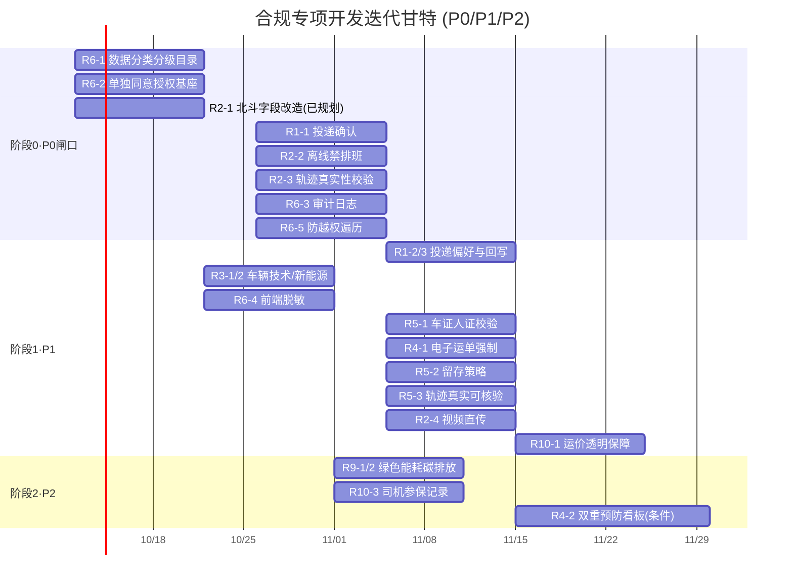

# 合规专项开发迭代排期与甘特（PM 排期依据）

> 文档定位：基于《合规开发优先级清单.md》已落地的 **19 项合规需求（P0×7 + P1×9 + P2×3）**，将其转化为**可排期的迭代甘特**。所有合规约束已写入各任务卡"合规约束"子节，本文仅做**排期与节奏**拆分，不新增需求。
> 适用范围：**合规专项**。业务功能（移动端三端、管理端业务页、OPS 看板、财务结算、IoT 等）按各自任务卡排期，与本文**并行耦合**——合规项就地并入对应 Sprint，不另起独立工程。
> 生成日期：2026-10-06。

---

## 1. 迭代模型与假设

| 假设项 | 取值 | 说明 |
|---|---|---|
| 迭代周期 | **2 周 / Sprint**（10 工作日） | 可按团队节奏调整为 1 周或 3 周 |
| Sprint 容量 | 约 **20–30 人日**（按 2–3 名开发） | 用于校验排期是否过载 |
| 估算换算 | **S≈2–3 人日 / M≈5–8 人日 / L≈10–15 人日** | 相对参考，非承诺工时 |
| 闸口规则 | **P0 全部完成前禁止上线** | 详见 §7 与《联调就绪检查清单》§9 |
| 关键路径起点 | **R6-1 数据分类分级目录** | 是 R6-4/R6-5 的前置，须 Sprint 0 最先启动 |

---

## 2. Sprint 排期总表（6 个 Sprint）

> 阶段 0（P0 闸口）拆入 Sprint 0–1；阶段 1（P1）拆入 Sprint 2–4；阶段 2（P2）拆入 Sprint 5–6。**R4-2 为条件项**，仅危货/属地监管启用时升 P0 并提前至 Sprint 2。

| Sprint | 建议周期 | 阶段 | 含合规项（#） | 估算合计 | 交付物 / 里程碑 | 依赖 |
|---|---|---|---|---|---|---|
| **Sprint 0** | W1–W2 | 阶段0基座 | R6-1(4)、R6-2(5)、R2-1(已规划北斗字段确认) | M+S ≈ 7–11 人日 | 数据分类分级目录落地；移动端隐私授权基座；北斗字段改造启动 | 隐私政策文本、R2-1 规划就绪 |
| **Sprint 1** | W3–W4 | 阶段0收口 | R1-1(1)、R2-2(2)、R2-3(3)、R6-3(6)、R6-5(7) | 5×M ≈ 25–40 人日 | **P0 闸口全部就绪**：投递确认、离线禁排班、轨迹校验、审计日志、防越权 | R6-1、R2-1 |
| **Sprint 2** | W5–W6 | 阶段1 | R1-2/3(8)、R3-1/2(10)、R6-4(15)、R5-1(12) | 3M+S ≈ 17–27 人日 | 投递偏好/回写、车辆技术/新能源字段、前端脱敏、车证人证校验 | R1-1、R6-1 |
| **Sprint 3** | W7–W8 | 阶段1 | R4-1(11)、R5-2(13)、R5-3(14)、R2-4(9) | 4M ≈ 20–32 人日 | 电子运单强制、留存策略、轨迹真实、视频直传 | R6-3、R2-3 |
| **Sprint 4** | W9–W10 | 阶段1收口 | R10-1(16) | M ≈ 5–8 人日 | 运价透明 + 运费保障/垫付 | 无 |
| **Sprint 5** | W11–W12 | 阶段2 | R9-1/2(17)、R10-3(19) | M+S ≈ 7–11 人日 | 绿色能耗/碳排放统计、司机参保字段 | R3-1 |
| **Sprint 6** | W13+（条件） | 阶段2 | R4-2(18) | L ≈ 10–15 人日 | 双重预防看板（仅危货/监管要求时启用） | R4-1 |

> **容量校验**：各 Sprint 估算均在 20–40 人日区间内，与 2–3 人团队容量匹配；Sprint 1 偏重（5×M），建议优先保障或借调 1 人。

---

## 3. 甘特图（文本视图）

```
合规项(阶段)            W1 W2 W3 W4 W5 W6 W7 W8 W9 W10 W11 W12 W13
─────────────────────────────────────────────────────────────────
R6-1 分类分级(0)        ██ ██
R6-2 单独同意(0)        ██ ██
R2-1 北斗字段(0,已规划)  ██ ██  (确认/改造)
R1-1 投递确认(0)            ██ ██
R2-2 离线禁排班(0)          ██ ██
R2-3 轨迹校验(0)            ██ ██
R6-3 审计日志(0)            ██ ██
R6-5 防越权(0)              ██ ██
─────────────────────────────────────────────────────────────────
R1-2/3 投递偏好(1)              ██ ██
R3-1/2 车辆技术(1)               ██ ██
R6-4 前端脱敏(1)                 ██ ██
R5-1 车证人证(1)                 ██ ██
R4-1 电子运单(1)                     ██ ██
R5-2 留存策略(1)                       ██ ██
R5-3 轨迹真实(1)                       ██ ██
R2-4 视频直传(1)                       ██ ██
R10-1 运价透明(1)                         ██ ██
─────────────────────────────────────────────────────────────────
R9-1/2 绿色能耗(2)                               ██ ██
R10-3 司机参保(2)                               ██ ██
R4-2 双重预防(2,条件)                                 ██ ██
─────────────────────────────────────────────────────────────────
里程碑:
  M0 = Sprint0结束: 数据基座就绪        ▲W2
  M1 = Sprint1结束: **P0 上线闸口闭合**   ▲W4  ← 禁止上线前必过
  M2 = Sprint4结束: P1 全量交付          ▲W10
  M3 = Sprint5结束: P2 主体交付          ▲W12
```

### Mermaid 甘特（可贴入支持的工具渲染）



---

## 4. 关键路径与阻塞风险

| 风险点 | 影响 | 应对 |
|---|---|---|
| **R6-1 分类分级目录**是 R6-4/R6-5 前置 | 阻塞 Sprint 1 数据安全类收口 | Sprint 0 最先启动，目录文档 + 配置先行 |
| **R2-1 北斗字段改造**是 R2-2/R2-3 前置 | 阻塞离线禁排班/轨迹校验 | "新增真实需求①"已规划，须确认其落地进度不晚于 Sprint 0 结束 |
| Sprint 1 估算偏重（5×M） | 可能超容量 | 优先保障 P0 闸口；或借调 1 人、将 R6-5 微调至 Sprint 2 头部 |
| R4-2 双重预防为**条件项** | 普通自营场景不强制 | 仅在危货/属地监管启用时升 P0，提前至 Sprint 2，否则置 Sprint 6 软性扩展 |
| 业务迭代与合规 Sprint 并行 | 同一模块多人改冲突 | 合规子节"就地并入"，由该模块负责人在同一分支实现，避免跨 Sprint 等待 |

---

## 5. 与业务梯队的耦合（不另起工程）

合规项**就地并入**对应任务卡，与既有五梯队**并行排期**：

| 合规项 | 并入的业务任务卡 / 梯队 | 耦合 Sprint |
|---|---|---|
| R1-1/2/3 | 快递员端任务卡 C-5、客户小程序 P1-3/P1-8 | Sprint 1–2 |
| R2-1/2/3、R6-5 | 司机端 D-10、pd-netty、pd-dispatch、后端接口文档 | Sprint 0–1 |
| R3-1/2、R9 | 管理端车辆档案、OPS-3/4、pd-base | Sprint 2、5 |
| R4-1、R2-4、R10-1 | 财务结算与调度运力IoT任务卡（FIN-1/IOT-2）、运单管理 | Sprint 3–4 |
| R5-1/2/3 | pd-dispatch 派车、pd-netty、全链路留存 | Sprint 2–3 |
| R6-1/2/3/4 | 数据治理（pd-base/pd-user）+ 移动端授权 + 管理端脱敏 | Sprint 0–2 |
| R10-3 | 司机端 D-10/D-11、管理端司机管理页 | Sprint 5 |
| R4-2 | OPS-5 安全看板（条件） | Sprint 6/条件 |

---

## 6. 里程碑与闸口判定

| 里程碑 | 时点 | 准入条件 |
|---|---|---|
| **M0 数据基座就绪** | Sprint 0 末 | R6-1 目录 + R6-2 授权基座 + R2-1 字段改造完成 |
| **M1 P0 上线闸口闭合** ⛔ | Sprint 1 末 | **3 项 P0 硬闸口（FR-30/31/36）**全部联调通过（见 §7）；FR-32~35 为 P1 不阻塞 M1 |
| **M2 P1 全量交付** | Sprint 4 末 | 9 项 P1 全部上线 |
| **M3 P2 主体交付** | Sprint 5 末 | 绿色能耗 + 司机参保完成（双重预防视条件） |

### §7 上线前合规就绪判定（M1 闸口，与《联调就绪检查清单》§9 合并）

下列任一项未勾选，**禁止上线**：

- [ ] R1-1 派件前投递方式确认 + 改投二次确认联调通过
- [ ] R2-2 离线/故障车辆无法进入排班与运输任务（接口校验生效）
- [ ] R2-3 轨迹上报带设备标识 + 异常跳变告警可用
- [ ] R6-1 数据分类分级目录已落地（定位集/司机/客户 = 重要或敏感）
- [ ] R6-2 移动端敏感信息采集前单独授权弹窗生效
- [ ] R6-3 涉及个人信息/轨迹的查询导出均留痕，日志可查 ≥6 月
- [ ] R6-5 订单/轨迹查询接口强制鉴权，无法越权遍历他人数据

---

## 8. 备注

- **估算为相对参考**：S/M/L 仅用于排期平衡，实际工时以团队速率（velocity）校准后回填。
- **不引新中间件**：数据治理用现有 pd-base/pd-user + 网关鉴权扩展；审计日志可落新表，不引新存储组件。
- **边界条款不实现**：网络货运撮合/税务套利（R5 平台部分）、危货规范（R4 非条件部分）写入"不做清单"，仅业务拓展时再评估。
- **本排期与业务范围解耦**：本文只排合规专项；移动端三端、管理端业务页、OPS/财务/IoT 等业务迭代排期见各自任务卡，二者在同一 Sprint 内由模块负责人合并实现。
