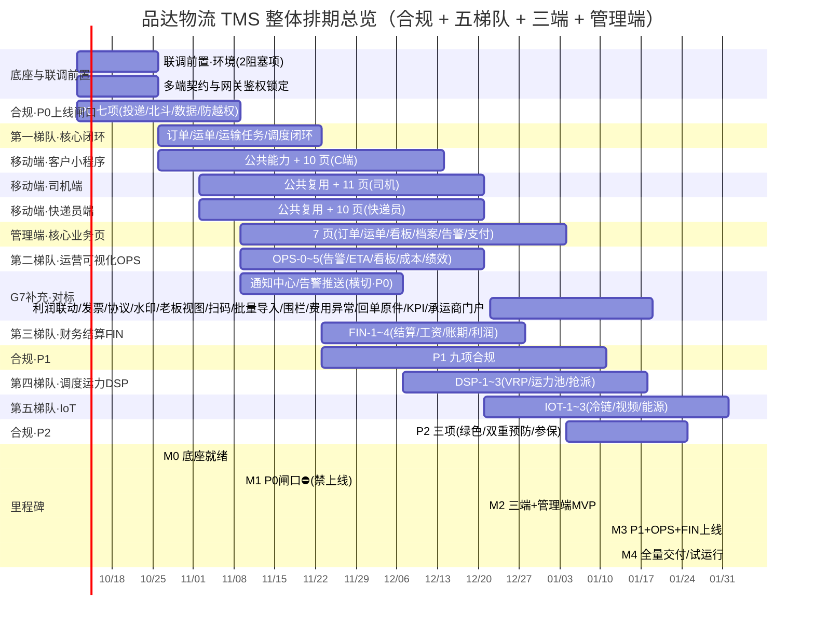

# 品达物流 TMS · 整体项目排期总览（Master Gantt）

> 文档定位：**给老板 / PM 看的全局排期**。把《合规开发迭代排期甘特.md》（合规专项）与业务五梯队、三端移动化、管理端业务页**合并到一张总甘特**，统一时间基线、统一里程碑，便于跨团队排期与资源协调。
> 本总览**不做需求**，只做**节奏与依赖**汇总；每一项的具体范围、接口、合规约束均以各任务卡为准（文末附引用索引）。
> 适用范围：需求/规划层，未涉及任何代码改动。生成日期：2026-10-06。

---

## 1. 一句话总览（Executive Summary）

- **项目体量**：自营/加盟运输管理 TMS，含 1 个管理端（Vue2.6 既有工程）、3 个移动端（uni-app 新建）、5 个业务梯队后端模块，外加一套法规驱动的合规专项。
- **总周期（规划）**：约 **16 周（2026-10-12 → 2027-02-01）**，按 2 周/Sprint、多团队并行推进。
- **上线闸口（红线）**：**M1（2026-11-09）合规 P0 七项未全通过，禁止上线**；联调前须先清除 2 个环境阻塞项（见 §4）。
- **关键路径**：底座 → 合规 P0 闸口（M1）→ 移动端/管理端 MVP（M2）→ OPS+FIN+P1（M3）→ DSP+IoT+P2（M4 全量交付）。
- **最大不确定项**：司机视频（VID）、冷链温控（IOT-1）、客户按订单号查轨迹（后端待改造）三项标 **"后端待建"**，排期已留缓冲，缺失不影响主链路。

---

## 2. 阶段划分（5 个 Phase）

| Phase | 周期 | 并行工作流 | 里程碑 | 交付意义 |
|---|---|---|---|---|
| **P0 底座** | W1–W2（10/12–10/23） | 联调前置 + 多端契约 + 数据基座(R6-1) | **M0 底座就绪** | 可开工、可联调 |
| **P1 闸口+核心** | W3–W4（10/26–11/20） | 合规 P0 全量 + 第一梯队核心闭环 + 移动端公共能力 | **M1 P0 上线闸口⛔** | 合规达标，准许上线 |
| **P2 端到端 MVP** | W5–W8（11/23–12/21） | 三端页面 + 管理端核心页 + OPS + FIN + 合规 P1 | **M2 三端+管理端 MVP** | 内部试运行 |
| **P3 运营+财务深化的** | W9–W10（12/22–01/11） | 合规 P1 收口 + OPS/FIN 上线 + DSP 启动 | **M3 P1+OPS+FIN 上线** | 运营可视化可用 |
| **P4 调度+IoT+合规收尾** | W11–W16（01/12–02/01） | DSP + IoT + 合规 P2 | **M4 全量交付 / 试运行** | 全功能对外试运行 |

> W = 自然周；W1 起点 2026-10-12（周一）。周期估算为相对参考，实际以团队速率（velocity）校准。

---

## 3. 总甘特图（Master Gantt）

### 3.1 文本视图

```
工作流                      10/12  10/26  11/09  11/23  12/07  12/21  01/04  01/18  02/01
─────────────────────────────────────────────────────────────────────────────────────
底座与联调前置              ██ ██
合规 P0 七项(闸口)         ██ ██  ██ ██
第一梯队·核心闭环                 ██ ██
移动端·客户(C端 10页)             ████████████
移动端·司机(11页)                     ████████████
移动端·快递员(10页)                   ████████████
管理端·核心业务页(7页)                  ████████████████
通知中心/告警推送(横切·P0)               ██████████
G7/行业补充·利润联动/发票/协议/水印/扫码/批量导入/围栏/费用异常/回单原件/KPI/承运商门户(P1对标)           ██████████
第二梯队·OPS-0~5                       ████████
第三梯队·FIN-1~4                            ██████
合规 P1 九项                                  ████████
第四梯队·DSP-1~3                                ██████
第五梯队·IoT-1~3                                    ██████
合规 P2 三项                                            ████
─────────────────────────────────────────────────────────────────────────────────────
里程碑:
  M0  底座就绪            ▲10/26
  M1  P0 闸口⛔(禁上线)   ▲11/09   ← P0 七项全过才许上线
  M2  三端+管理端 MVP     ▲12/21   ← 内部试运行起点
  M3  P1+OPS+FIN 上线     ▲01/11
  M4  全量交付/试运行     ▲02/01
```

### 3.2 Mermaid 甘特（可贴入支持的工具渲染）



---

## 4. 各工作流范围与依赖（老板/PM 速查）

| # | 工作流 | 范围（对应任务卡章节） | 估算量级 | 依赖 / 阻塞 | 产出 |
|---|---|---|---|---|---|
| 1 | **底座与联调前置** | 《联调就绪检查清单》§2 两阻塞项 + 《多端数据打通》§4 | S（运维+文档） | ① ~~重启网关使 Redis 生效~~ **已解除**（j2cache 路径已 Nacos 推送修复，无需重启）；② 三端接口注册进 `pd_auth.pd_auth_resource`（需授权写库） | 环境可联调、契约锁定 |
| 2 | **合规 P0（上线闸口）** | 《合规开发优先级清单》P0×7（R1-1/R2-2/R2-3/R6-1/R6-2/R6-3/R6-5） | 25–40 人日 | R6-1 目录（前置）、R2-1 北斗字段（已规划） | **M1 闸口闭合** |
| 3 | **第一梯队·核心闭环** | 订单 12 级状态机 / 运单 / 运输任务 5 级 / 调度 Quartz 5 阶段（代码已存在，主要是联调与闭环打磨） | 20–30 人日 | 底座 | 核心业务跑通 |
| 4 | **移动端·客户小程序** | 《客户小程序开发任务卡》P0-1~5 + P1-1~10（10 页） | 40–60 人日 | 底座、uni-app 工程、P0-0 微信登录 | C 端可用 |
| 5 | **移动端·司机端** | 《司机端任务卡》D-P0-1~3 + D-1~11（11 页） | 45–65 人日 | 复用客户公共能力、北斗字段 | 司机端可用 |
| 6 | **移动端·快递员端** | 《快递员端任务卡》C-P0-1~2 + C-1~10（10 页） | 40–55 人日 | 复用客户公共能力、R1 投递确认 | 快递员端可用 |
| 7 | **管理端·核心业务页** | 《管理端业务页面开发任务卡》§一~§七（7 页） | 35–50 人日 | 底座、告警/支付后端（部分待建） | 管理后台可用 |
| 8 | **第二梯队·OPS** | 《运营可视化与成本管控任务卡》OPS-0~5（3 新表） | 40–55 人日 | 核心闭环、R9 绿色（P2） | 运营可视化 |
| 9 | **第三梯队·FIN** | 《财务结算与调度运力IoT任务卡》FIN-1~4（4 新模块+DDL） | 45–60 人日 | OPS、R10-1 运价透明 | 财务结算 |
| 10 | **第四梯队·DSP** | 同上 DSP-1~3（VRP 升级/外协运力池/抢派双模）+ **整合项：承运商端门户(L-1)/KPI(N-6)/黑名单(L-2)** | 55–80 人日 | FIN、调度内核 | 智能调度 |
| 11 | **第五梯队·IoT** | 同上 IOT-1~3（冷链/视频货损/能源结算） | 40–55 人日 | 视频后端待建(VID)、R9 能耗 | IoT 监控 |
| 12 | **合规 P1** | P1×9（R1-2/3/R2-4/R3/R4-1/R5-1/2/3/R6-4/R10-1） | 17–32 人日 | R1-1、R6-1 | M3 |
| 13 | **合规 P2** | P2×3（R9 绿色/R4-2 双重预防/R10-3 参保） | 7–15 人日 | R3-1、R4-1 | M4 |

> **估算说明**：S≈2–3 / M≈5–8 / L≈10–15 人日，为相对参考值，非承诺工时；多工作流并行，墙钟周期取决于最长关键链（约 16 周）。

---

## 5. 关键路径与资源

- **关键路径（最长链）**：底座(2w) → 合规 P0(2w，M1) → 移动端 MVP(7w) + 管理端(8w) → OPS/FIN(至 W10) → DSP(至 W8)/IoT(至 W9) + 合规 P2(至 W10) → **M4（2027-02-01）**。
- **资源建议**（依并行度推算）：
  - 前端 2 人（uni-app 三端共享工程 + 管理端 Vue2.6），三端公共能力由客户端先沉淀、司机/快递员复用。
  - 后端 2–3 人（OPS/FIN/DSP/IoT 接力，共享 pd-work/pd-dispatch/pd-netty）。
  - 兼测试/联调 1 人（对接《联调就绪检查清单》）。
- **阶段容量校验**：W5–W10 为高峰（移动端 + 管理端 + OPS + FIN + 合规 P1 并行），建议此窗口保障前端满编、合规 P1 就地并入各模块分支实现，避免跨 Sprint 等待。

---

## 6. 风险与里程碑闸口

| 风险点 | 影响 | 应对 |
|---|---|---|
| **联调阻塞项**：① ~~Redis 待重启~~ **已解除**（真根因是网关 j2cache 配置指向不存在文件，已修正）；② **权限资源未注册**（阻断 C，仍未清） | 权限未注册时三端接口被网关判"未知请求"拒绝 | ② 属写库动作，需授权；模板见 `docs/sql/pd_auth_resource_注册模板_阻断C.sql` |
| **合规 P0 七项是上线红线** | 未过 M1 即上线 = 违规风险（邮政/网信处罚） | M1 闸口卡死，任一未过禁止上线 |
| **三项"后端待建"**（司机视频 VID / 冷链 IOT-1 / 客户按订单号查轨迹） | 对应页面/功能需后端补齐 | 排期已留缓冲，缺失期间前端用占位/隐藏入口，主链路不受影响 |
| 北斗字段改造(R2-1)是 R2-2/R2-3 前置 | 阻塞离线禁排班/轨迹校验 | 已规划"新增真实需求①"，确认不晚于 W2 落地 |
| 管理端告警/支付后端部分待建 | 管理端 2 页需后端补接口 | 前端先行 mock，后端 OPS-0 / FIN 排期补齐 |
| 业务迭代与合规并行同模块改冲突 | 合并冲突 | 合规子节"就地并入"，由模块负责人同一分支实现 |

### 里程碑闸口清单（与《联调就绪检查清单》§9 合并执行）

- **M0 底座就绪（10/26）**：2 阻塞项清除 + 多端契约锁定 + R6-1 数据目录落地。
- **M1 P0 上线闸口⛔（11/09）**：**3 项 P0 硬闸口（FR-30/31/36：投递确认 / 离线禁排班 / 轨迹真实）**全部联调通过。**任一未过禁止上线**；FR-32~35（分类分级/单独授权/审计/防越权）为 P1，不阻塞 M1 但需限期补（见需求文档 v2.2 §5.2 D）。
- **M2 三端+管理端 MVP（12/21）**：三端核心流程跑通 + 管理端 9 页（6 P0 + 2 P1 + 1 P2）上线，启动内部试运行。
- **M3 P1+OPS+FIN 上线（01/11）**：P1 九项交付 + 运营可视化 + 财务结算可用。
- **M4 全量交付/试运行（02/01）**：DSP + IoT + 合规 P2 完成，全功能对外试运行验收。

---

## 7. 引用文档索引（可追溯）

| 工作流 | 权威文档 |
|---|---|
| 联调前置 | 联调就绪检查清单.md §2 |
| 多端契约 | 多端数据打通与统一领域模型.md §4 |
| 合规排期 | 合规开发优先级清单.md / 合规开发迭代排期甘特.md / 物流行业合规与监管要求.md |
| 客户小程序 | 客户小程序开发任务卡.md |
| 司机端 | 司机端任务卡.md |
| 快递员端 | 快递员端任务卡.md |
| 管理端 | 管理端业务页面开发任务卡.md |
| 第二梯队 OPS | 运营可视化与成本管控任务卡.md |
| 第三~五梯队 FIN/DSP/IoT | 财务结算与调度运力IoT任务卡.md |
| 接口基线 | 后端接口文档.md |
| 现状审计 | 页面功能审查报告.md / 需求文档v2_现状梳理与竞品借鉴.md |

---

## 8. 备注

- **不引新中间件**：北斗(JT/T 808 复用 Netty)、视频(云厂商 RTC/国标)、合规审计(新表不引新存储)均按既有决策，不新增基础设施负担。
- **边界条款不实现**：网络货运撮合/税务套利、危货规范（R4 非条件部分）写入"不做清单"，仅业务拓展时再评估。
- **与合规甘特的关系**：本文是合规甘特的"放大版全局视图"；合规专项的逐 Sprint 细节仍以《合规开发迭代排期甘特.md》为准，二者里程碑（M0–M4）完全一致。
