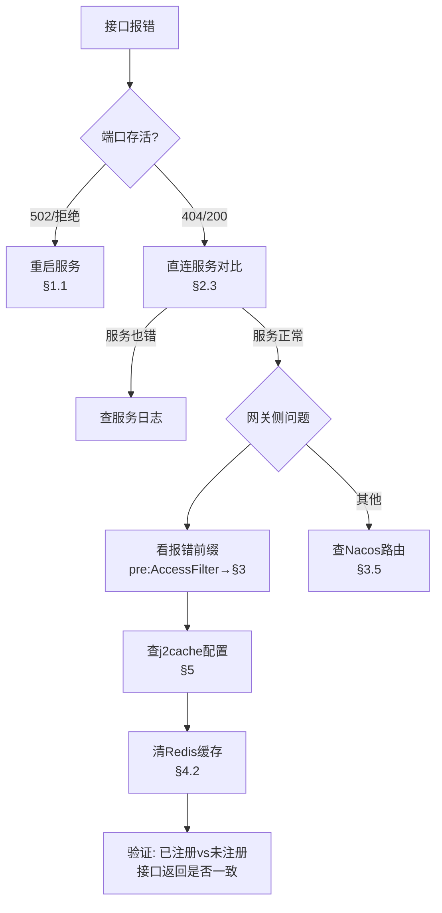

# 环境故障排障手册（网关 / 鉴权 / 菜单 / 配置）

> **日期**：2026-10-06
> **来源**：本日联调实战排障沉淀（网关 500、登录无菜单、配置丢失等）
> **用途**：开发/测试/运维遇到"接口报错但不知根因"时的**第一本排查手册**
> **价值**：把"报错信息 → 根因 → 处置"固化成表，避免每次重新试错

---

## 〇、先读这一段：排障纪律（血的教训）

本日报障中出现多次"**响应互相矛盾**"导致差点误判：

| 现象 | 真相 |
|---|---|
| `menu/router` 有时返回 `[]`、有时 `''`、有时"系统繁忙" | **服务在反复宕启/抖动** |
| 同一 URL 第一次 500、第二次 200 | 服务刚重启完 |
| `upstream connect failed os error 10061` | 目标进程**根本没在监听** |

### ✅ 三条铁律

1. **先探活，再分析**：任何"接口行为异常"的第一步是确认进程存活（见 §1.1），**不要一上来就读业务代码**。
2. **502/连接拒绝 ≠ 业务问题**：这说明是**基础设施层**，与代码逻辑无关。
3. **改了 Nacos 配置 ≠ 一定生效**：Redis/连接池类配置**必须重启进程**（Nacos 推送不重建连接池）；但普通配置项（如路由、白名单）**推送即生效**。

---

## 一、故障速查表（先看现象对号入座）

| 现象 / 报错 | 根因层 | 快速定位 | 处置 | 详见 |
|---|---|---|---|---|
| `500 pre:AccessFilter` | 网关鉴权器 | `curl 网关 /api/authority/menu/router` 看是否 500 | **查网关 j2cache 配置**（§3.1） | §3 |
| `404 /api/gate/xxx` | 网关路由 | 查 Nacos 路由表 | 确认路径前缀/是否走网关 | §3.4 |
| `502` / `upstream connect failed` | **进程挂了** | `curl 直连该服务端口` | **重启服务**（§1.1） | §1.1 |
| `{"code":40003,"msg":"缺少token参数"}` | 缺 JWT 头 | 请求头加 `token` | 前端拦截器问题 | §3.3 |
| `{"code":40005,"msg":"解析token失败"}` | token 无效/过期 | 重新登录 | token 有效期 **7200s** | §3.3 |
| 登录成功但**菜单为空** | 菜单 userId 为 null | 见 §4 | 已修代码，待部署 | §4 |
| `{"code":-1,"msg":"系统繁忙~请稍后再试~"}` | 下游不可达 | 看网关日志 | 查下游服务是否存活 | §1.1 |
| 改 Nacos 后行为没变 | 配置未生效 | 区分配置类型（§2.2） | 路由类推送即生效；连接池类须重启 | §2.2 |
| Nacos 配置"消失" | 读了错误 group | 确认 `group=pinda-tms` | 见索引·关键约束速记（namespace/group 坐标） | — |
| `code:0` 但数据为空 | 业务逻辑/缓存 | 查 Redis 缓存 key | 见 §4.2 | §4.2 |

---

## 二、排障工具箱（先会用工具）

### 2.1 服务存活探测（最高频，先跑这个）

```bash
# 单个服务
curl -s -o /dev/null -w "%{http_code}\n" --max-time 5 "http://192.168.20.130:9000/actuator/health"

# 批量（按项目实际端口改）
for p in 9000 8760 8161 8162 8163 8164 8185 8186 8187 8189 8190 8191 8192; do
  echo -n "$p -> "
  curl -s -o /dev/null -w "%{http_code}\n" --max-time 4 "http://192.168.20.130:$p/actuator/health"
done
```

**结果判读**：

| 返回 | 含义 |
|---|---|
| `200` | 健康 |
| `404` | **进程在**（该路径无此端点，正常现象） |
| `502` | 🔴 **进程或依赖故障** |
| 空/`000` | 🔴 **进程没在监听**（`os error 10061`） |

> ⚠️ **别把 404 当成故障**——项目大多没开放 `/actuator/health`，404 反而说明**端口活着**。

### 2.2 判断"改了配置生效没有"

| 配置类型 | 生效方式 | 验证 |
|---|---|---|
| 路由 `zuul.routes` | ✅ **Nacos 推送即生效** | 直接 curl 新路径 |
| 白名单 `ignore.auth.url` | ✅ 推送即生效 | 免鉴权路径应可访问 |
| `context-path` | ⚠️ 需重启（Servlet 容器级） | `curl` 看路径 |
| `spring.redis` / `j2cache` | 🔴 **必须重启**（连接池启动时装配） | 重启后看日志 |
| `authentication.expire` | 🔴 需重启 | 登录后看 token 有效期 |

### 2.3 直连绕过网关（定位"是网关的问题还是服务的问题"）

**这是最有用的一招**：

```bash
# 经网关（可能 500）
curl -s -o /dev/null -w "%{http_code}\n" "http://192.168.20.130:8760/api/authority/menu/router"

# 直连服务（如果 200，说明服务健康，问题在网关）
curl -s -o /dev/null -w "%{http_code}\n" "http://192.168.20.130:9000/menu/router"
```

| 组合 | 结论 |
|---|---|
| 网关 500 + 直连 200 | **网关侧问题**（过滤器/配置）→ §3 |
| 网关 500 + 直连 500 | **服务自身问题** → 看服务日志 |
| 网关 502 + 直连 502 | **服务已挂** → §1.1 重启 |

---

## 三、网关鉴权体系（理解它才能正确排障）

### 3.1 请求链路

```
浏览器 (Vue2 管理端)
  ↓  请求头携带 JWT：token: xxx
网关 pd-gateway:8760/api
  ├─ [pre] TokenContextFilter   解析 JWT → 向下游注入 userid/account/name/orgid/stationid 头
  └─ [pre] AccessFilter         ① 查"需鉴权资源清单"（j2cache）
                                ② 查"当前用户资源权限"（j2cache）
                                ③ 两者都不匹配 → UNAUTHORIZED
  ↓
下游服务 pd-web-* / pd-auth-server
  └─ TokenAuthInterceptor      检查 userid 头（缺 → 401）
```

> **关键**：两个过滤器都是 `filterType() = "pre"`，所以报错前缀是 **`pre:AccessFilter`**——看到这个字符串，就能**精确定位到 AccessFilter** 而不用再猜。

### 3.2 AccessFilter 的两道关卡（源码逻辑）

`pd-authority/pd-apps/pd-gateway/.../filter/AccessFilter.java`

```java
// 关卡1：请求是否在"需鉴权资源清单"里
List<String> resourceNeed2Auth = cacheChannel.get(RESOURCE, RESOURCE_NEED_TO_CHECK).getValue();
if (resourceNeed2Auth == null) {
    resourceNeed2Auth = resourceApi.list().getData();       // Feign 调 auth-server
    if (resourceNeed2Auth != null) { cacheChannel.set(...); }
}
if (resourceNeed2Auth != null) {                             // ★ 为 null 则整段跳过
    long count = resourceNeed2Auth.stream().filter(r -> permission.startsWith(r)).count();
    if (count == 0) { errorResponse(UNAUTHORIZED); return null; }   // 判"未知请求"
}

// 关卡2：用户是否有该资源权限
List<String> userResource = cacheChannel.get(USER_RESOURCE, userId).getValue();
...
if (!permission.startsWith(r)) { errorResponse(UNAUTHORIZED); }      // 无权限
```

> ⚠️ **重要特性**：`resourceNeed2Auth == null` 时**关卡1整段被跳过 → 所有请求放行**。
> 这意味着"接口返回 200"**不等于**"鉴权生效"。判断鉴权是否真正工作，必须对比：
> **已注册接口** 与 **未注册接口** 的返回是否一致（若都放行 = 关卡1失效）。

### 3.3 鉴权相关请求头（排障必记）

| 头名 | 谁设置 | 用途 |
|---|---|---|
| `token` | **前端** | JWT 令牌（**不是 Authorization**） |
| `userid` / `account` / `name` / `orgid` / `stationid` | **网关注入** | 下游通过 `BaseContextHandler`(ThreadLocal) 读取 |
| 常量定义 | `BaseContextConstants.JWT_KEY_USER_ID = "userid"` | 网关与下游同名 |

- JWT 有效期 **7200s（2 小时）**，**无 refreshToken** → 过期即 401，需重新登录。
- 下游服务通过 `ContextHandlerInterceptor`（由 `LoginArgResolverConfig` 自动注册）把头写入 ThreadLocal。

### 3.4 资源表与 url 写法（注册接口必看）

`pd_auth.pd_auth_resource` 表中 `url` 填**服务内路径**，**不含 `/api` 和网关段**：

| 网关请求 | permission 计算 | 表中 `url` 填 |
|---|---|---|
| `GET /api/web-driver/user/profile` | `GET/user/profile` | `/user/profile` |
| `POST /api/authority/resource/page` | `POST/resource/page` | `/resource/page` |

计算规则（源码 `AccessFilter:63-67`）：`permission = method + 去掉"/api"+去掉"网关服务名段"`。

📄 完整 SQL 模板见 `docs/sql/pd_auth_resource_注册模板_阻断C.sql`。

### 3.5 网关路由速查（13 条，2026-10-06 实测）

| 前缀 | 目标服务 | 端口 |
|---|---|---|
| `/web-manager/**` | pd-web-manager | 8161 |
| `/web-driver/**` | pd-web-driver | 8162 |
| `/web-courier/**` | pd-web-courier | 8163 |
| `/web-customer/**` | pd-web-customer | 8164 |
| `/netty-service/**` | pd-netty | 8192 |
| `/auth/**`、`/authority/**` | pd-auth-server | 9000 |
| `/oms/**` `/work/**` `/dispatch/**` `/base/**` `/user/**` `/aggregation/**` | 内部 Feign 服务 | 8185~8191 |

> ⚠️ `ignored-services: '*'` 表示**内部服务默认无路由**，新增网关暴露接口必须**显式配路由**。

---

## 四、专项：登录成功但菜单为空

### 4.1 根因（2026-10-06 已修代码）

`MenuController.myRouter` 中**取 userId 的逻辑被整段注释**，而前端 `getRouter({})` 也不传 userId → 缓存 key 变成 `user_menu:null`（值为 `[0]`）→ 查不到菜单。

**已修复**（`pd-authority/.../MenuController.java`）：
```java
if (StrUtil.isBlank(userId)) {          // ★ 原注释写 userId<=0，String 比较会抛异常
    userId = String.valueOf(getUserId());
}
```
`myMenus()` 一并修复。**编译已通过，待部署**。

### 4.2 菜单相关缓存 key（排障可直接用）

| Redis key | 内容 | 说明 |
|---|---|---|
| `user_menu:{userId}` | 菜单 ID 列表 | ✅ 正常应存 ID |
| `user_menu:null` | `[0]` | 🔴 **脏 key**，命中它必然空菜单 |
| `resource:resource_need_to_check` | 90 条资源标识（2026-10-06 注册后） | 网关关卡1 数据源 |
| `user_resource:{userId}` | 用户资源权限 | 网关关卡2 数据源 |

```bash
# 查菜单缓存
redis-cli -h 192.168.20.130 -p 6379 KEYS "*menu*"
redis-cli -h 192.168.20.130 -p 6379 GET "user_menu:3"
# 清脏缓存（改完代码必做）
redis-cli -h 192.168.20.130 -p 6379 DEL "user_menu:null"
```

### 4.3 菜单数据自查 SQL

```sql
USE pd_auth;
-- 用户可见菜单数（userId=3 是 pinda）
SELECT COUNT(*) FROM pd_auth_menu WHERE is_enable=1 AND id IN (
  SELECT authority_id FROM pd_auth_role_authority ra
  JOIN pd_auth_user_role ur ON ra.role_id=ur.role_id
  WHERE ur.user_id=3 AND ra.authority_type='MENU');
-- 公共菜单数（本项目为 0，故非授权用户必然无菜单）
SELECT COUNT(*) FROM pd_auth_menu WHERE is_public=1;
```

---

## 五、专项：j2cache 配置错误导致网关全挂

### 5.1 故障现象与根因

网关 `j2cache.config-location` 误写为 `classpath:/j2cache-absent.properties`（**该文件不存在**）→ j2cache 初始化失败 → `cacheChannel.get()` 抛错 → 所有走鉴权的接口 `500 pre:AccessFilter`。

**已修正**为 `classpath:j2cache.properties`（与 auth-server 一致），Nacos 推送后**无需重启**即恢复。

### 5.2 怎么发现这类问题

```bash
# 找出 Nacos 里引用了不存在文件的配置项
curl -s "http://192.168.20.130:8848/nacos/v1/cs/configs?dataId=<配置名>&group=pinda-tms&tenant=<命名空间>" \
  | grep -E "config-location|classpath:"
```

再在仓库核对文件是否真的存在：
```bash
find pd-authority -name "j2cache*.properties"
```

> 🎯 **通用原则**：Nacos 配置里凡指向 `classpath:` 的文件，都要确认它真实存在。

---

## 六、Nacos 配置排障

### 6.1 三层坐标（搞懂就不会乱）

配置唯一确定于：**命名空间(namespace) + 分组(group) + 配置名(dataId)**。

| 项 | 本项目值 |
|---|---|
| 命名空间 | `1cb93ce4-dc0e-4730-b759-d35fd7ed93c3` |
| **在用分组** | **`pinda-tms`**（所有服务显式指定） |
| `DEFAULT_GROUP` | **不要清理**：本命名空间现存 27 条 = `pinda-tms` 23 + `DEFAULT_GROUP` 3（`common.yml`/`redis.yml`/`mysql.yml` 的历史副本）+ `SEATA_GROUP` 1（`service.vgroupMapping.pinda-tms-group`）。另：Seata 的 TC **必须**注册在 `DEFAULT_GROUP`（客户端 1.2.0 查询 group 固定），与这里的配置副本是两回事。清理前基线是 35 条，见《部署文档》§2.1、§五 |

### 6.2 text vs yaml 不是问题

Nacos 配置的 `type` **只影响控制台语法高亮**，客户端按 **dataId 后缀**决定解析器。`.yml` 后缀 → SnakeYAML 解析，与 `type` 无关。

### 6.3 读取配置的两种姿势

```bash
# ① 经网关（会走鉴权，需 token 头）
curl -s "http://192.168.20.130:8760/api/authority/menu/router" -H "token: xxx"

# ② 直连 Nacos（排障首选，不受网关影响）
curl -s "http://192.168.20.130:8848/nacos/v1/cs/configs?dataId=pd-gateway-test.yml&group=pinda-tms&tenant=1cb93ce4-dc0e-4730-b759-d35fd7ed93c3"
```

---

## 七、常见错误速查（踩过的坑）

| 错误做法 | 正确做法 | 后果 |
|---|---|---|
| 直连 `pd-web-*` 8161~8164 调试 | 一律经网关 `:8760/api` | 缺 `userid` 头 → **401** |
| 用 `Authorization` 头传 JWT | 用 **`token`** 头 | 401 |
| 写 `POST /xxx` 提交到 `@PutMapping` | 以接口文档为准（注意 GET/POST/PUT 区分） | 405/404 |
| 前端 URL 直接写 `pd-oms /pay/*` | 内部 Feign 服务**网关无路由** | **404** |
| Nacos 改 `spring.redis` 后只等推送 | **必须重启进程** | 配置不生效 |
| 用 `userId <= 0` 判断 String 判空 | 用 `StrUtil.isBlank()` | **NumberFormatException** |
| 服务 502 时还在读业务代码找原因 | **先探活**（§1.1） | 浪费时间、得出错误结论 |
| 改完菜单代码不清 `user_menu:null` | 部署后必清缓存 | 仍显示空菜单 |

---

## 八、标准排障流程（照做即可）



**文字版**：
1. **探活** —— 端口还在吗？（§1.1）
2. **对比** —— 直连服务 vs 经网关，谁错？（§2.3）
3. **定位** —— 看报错前缀（`pre:AccessFilter` / `pre:TokenContextFilter`）
4. **查配置** —— Nacos 里相关配置是否指向不存在的文件（§5.2）
5. **清缓存** —— Redis 相关脏 key（§4.2）
6. **验证** —— 用"已注册 vs 未注册"对比确认是否真生效（§3.2）

---

## 九、本日实战案例（供复盘参考）

| 时间 | 现象 | 真根因 | 教训 |
|---|---|---|---|
| 14:33 | 浏览器 4 条报错 | `/gate/dictionary/enums` 404 + 网关 500 | 前端遗留旧路径 + j2cache 配置错 |
| 15:57 | 接口仍 500 | **j2cache 指向不存在文件** | 不是"重启"能解决，配置本身错 |
| 16:11 | 配置太多看晕 | `DEFAULT_GROUP` 17 条死配置 | 命名空间+group+dataId 三层坐标 |
| 16:20 | 登录成功没菜单 | auth-server 宕机 + userId 为 null | **先探活**再读代码 |
| 16:44 | 响应互相矛盾 | 服务在反复重启 | 矛盾结果 = 基础设施问题 |

---

> **一句话总结**：**报错信息 → 探活 → 直连对比 → 定位过滤器 → 查配置/缓存**。绝大多数"接口不工作"都能在这 5 步内定位，其中 **502 优先重启、500 先查 j2cache、菜单空先查 userId** 是本项目三大高频入口。
